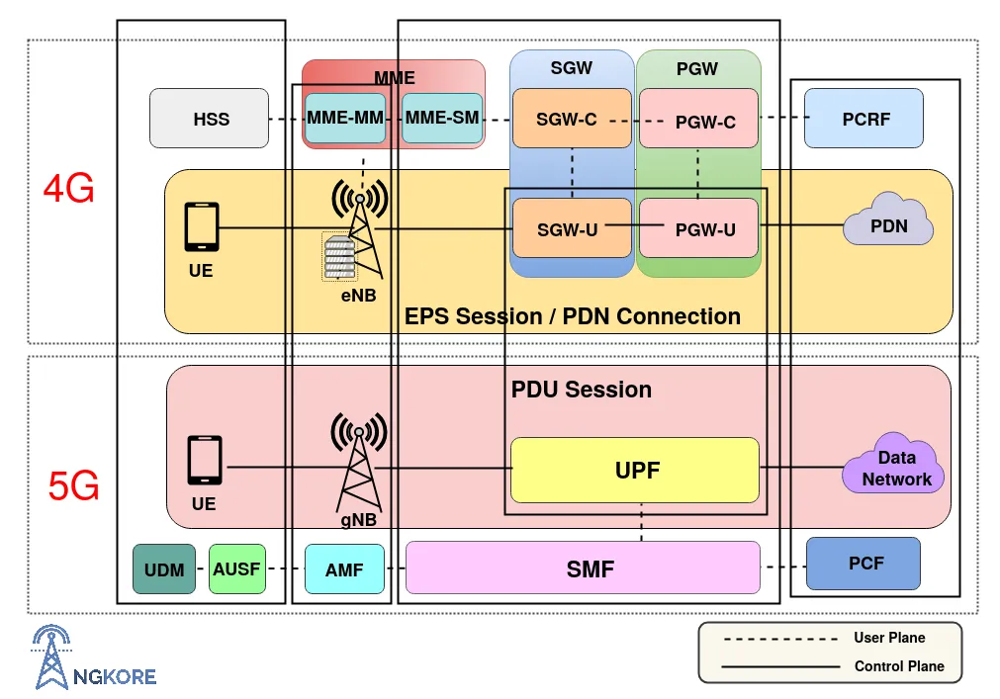
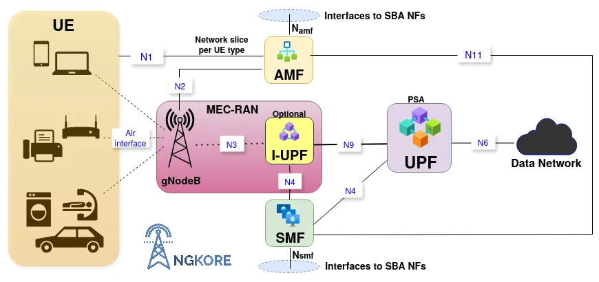
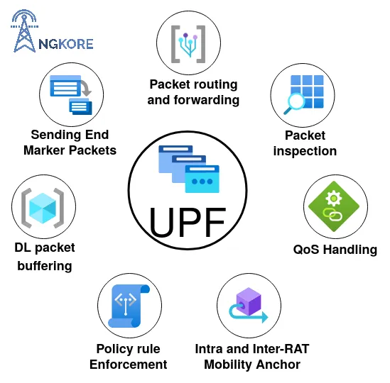
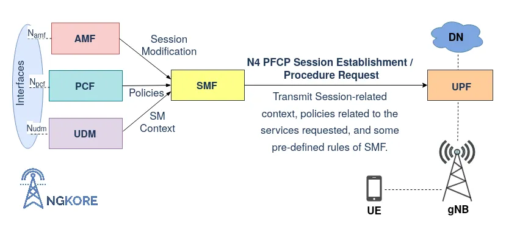
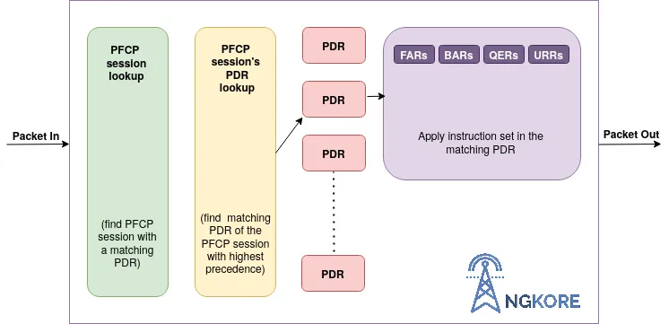
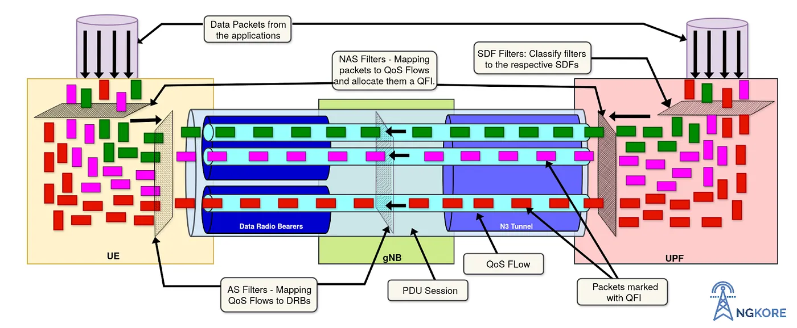

# 5G UPF Architecture

**Author:** [Shubham Kumar](https://www.linkedin.com/in/chmodshubham/)

**Published:** May 18, 2025

## Overview

The UPF (User Plane Function) is one of the most important NF (Network Function) of the 5G Core network. It is the second network function with which NR RAN interacts (during PDUs flow). UPF is the evolution of the CUPS (Control and User Plane Separation). It inspects, routes, and forwards the packets inside the QoS flows within the subscription policies. It also enforces the rules on the UL and DL traffic using SDF templates sent by the SMF over the N4 interface. It allocates or terminates the QoS Flows within the PDU Sessions when the corresponding services end.

## 5G User Plane over 4G

The 5G Core separates the Packet Gateway control and user plane (CUPS: Control and User Plane Separation). This decentralizes the data forwarding components of the 4G System and maps them inside the UPF in the 5G Core. The key benefit of the CUPS capability is that the control plane can be centralized while the UPF can be distributed to the various parts of the network to achieve low latency, flexible deployment, and independent scaling.   

The UPF is the only function in the User Plane of the 5G Core Network and it combines the functionality of the SGW-U (Serving Gateway-User Plane) and PGW-U (PDN Gateway-User Plane) of the 4G System.

### UPF Interfaces:

N3 — Interface between the gNB and the UPF. UPF maps the QoS flows through gNB and the SDAP layer of gNB manages all the radio bearers and QoS flows.

 

N9 — It is the Interface between two UPFs i.e the I-UPF (Intermediate UPF) and the PSA (PDU Session Anchor) UPF. This comes into operation when UE undergoes the handover procedure. Through this interface, the end marker packets are sent to the source RAN and user plane resources to the source UPF.

N6 — All the interactions between the DN (Data Network) and the UPF take place on this interface.

N4 — All the control and user plane information is transmitted over this interface using PFCP (Packet Forwarding Control Protocol) between the SMF (Session Management Function) and the UPF.

## UPF Functions:

1. **Anchor Point for the PDU Session** — It provides an interconnecting point for the PDU Session between the UE and Data Network. It also performs encapsulation and decapsulation of GTP-U (GPRS Tunneling Protocol-User Plane) across the connection.

2. **Downlink Packet buffering** — The BAR (Buffering Action Rules) controls the buffer status of the UPF. UPF keeps a DL buffer to ensure a steady flow and reduces the time to transmit packets from the data network to the UE. It stops the data buffering when the actual transmission starts.

3. **Traffic Usage Reporting** — SMF controls all the usage and traffic functions in UPF. It sends parameters over the N4 interface along with the session ID. Some of the important ones are -

- PDR (Packet Detection Rules) — It contains information that helps in classifying the packets or traffic arriving at the UPF.
- URR (Usage Reporting Rules) — It defines how the traffic identified by the PDR shall be accounted and how a certain measurement shall be reported.
- MAR (Multi-Access Reporting) — It contains information on how to handle traffic steering, switching, and splitting for a Multi-Access PDU Session.
- BAR (Buffering Action Rules) — It provides the instruction to manage the buffering behavior of the User Plane.
- FAR (Forwarding Action Rules) — It defines how a packet shall be buffered, dropped, and forwarded including encapsulation/decapsulation.

4. **Policy Rule Enforcement** — SMF transmits all the policies (provided by the PCF) and some of its predefined rules that apply to an individual user, to the UPF over the N4 interface. With these rules, UPF can dynamically enforce regulations to the different sessions and QoS flows. E.g. QoS Enforcement Rules.

5. **Handling QoS** — When the data packets arrive at the UPF, it maps them into the respective QoS flows with a corresponding QFI based on the priority and also modifies or terminates them according to the requirements of the user traffic.

6. **Packet routing and forwarding** — UPF directs the packets to the respective QoS flow with the corresponding QFI based on the priority. Similarly, during UL, UPF directs the packets to the specific data network in 2 different ways i.e. reflective mapping (when UE uses the same QoS flow for UL as it uses in the DL) and explicit mapping (when the device has a certain QoS flow in the UL regardless of what is configured in the DL).

7. **Packets Inspection** — UPF performs L3/L4 and L7 inspections for the user traffic. L3/L4 inspection involves IP-address/port matching whereas DPI (Deep Packet Inspection) involves matching of L7 header fields.

   > DPI is the process of examining both the header and the data the packet is carrying as they pass by a checkpoint in the network. DPI checks the information in the packet’s header such as destination IP address, source IP address, port number, and many more. DPI is an effective way of filtering data packets and finding at what point malware or the violation of content policies takes place.

8. **Anchor Point for Inter-RAT and Intra-RAT Mobility** — The UPF acts as the anchor point during Intra-RAT and Inter-RAT mobility i.e. it supports handover during cell change (Intra-RAT) and mobility from 4G to 5G or 5G to 4G network (Inter-RAT).

9. **Forwarding End Marker packets** — UPF sends end marker packets to the source RAN for reordering.

## UPF Flow:

### Transmission of N4 PFCP Session Context

When the UE is registered with the 5G network and starts exchanging data with the 5G System, then a User Plane is setup for the UE. SMF transmits session-related policies and some of its predefined rules to the UPF over the N4 PFCP (Packet Forwarding Control Protocol) interface so that UPF dynamically enforces policies to the ongoing QoS flows and PDU sessions.

PFCP is responsible for the transmission of control and user plane information between SMF and UPF.

SMF creates SDF (Service Data Flows)/TFT (Traffic Templates), along with that, sends some control parameters to the UPF to map the data packets with the corresponding QFI (QoS Flow Identifier) to the respective QoS flow according to the priority. SDF/TFT contains different parameters such as QFI, PDR, RQoS, UE RAN ID, FAR, URR, BAR, AN (Access Network) IP addresses, AN TEID (Access Network Tunnel Endpoint IDentifier), etc. This is transmitted during the N4 Session Establishment request or N4 Session Modification procedure. The parameters define how packets are identified (Packet Detection Rule/PDR), forwarded (Forwarding Action Rules/FARs), processed (Buffering Action Rules/BARs), marked (QoS Enforcement Rules/ \QERs), and reported (Usage Reporting Rules/URRs).

Addition, modification, or termination of SDF is carried out on the basis of ARP (Allocation and Retention Priority) value which is directly proportional to the functioning of the SDF in the occurring services. For example, if a new SDF is added to the UPF which has a higher ARP than the serving one then the existing SDF will drop and the new one will take its position.

Just like its name, it manages which SDF will retain and which one will be dropped.

## Anchor Point for the PDU Session

UPF provides an anchor point for the PDU Session between UE and UPF and also provides an external interconnection point to the Data Network. The objective of the UE’s PDU Session Establishment is to establish a default QoS Flow within a default PDU session between the UE and the DN (Data Network) via the gNB. Before the actual transmission of the data, UPF buffers the data packets to overcome the time delay at the start of the UL and DL data flow and stops buffering when DL data transmission is initiated from the data network.

 

The default QoS flow is a Non-GBR (Non-Guaranteed Bit Rate) QoS Flow without any packet Filter. It has the lowest precedence in terms of traffic mapping. If UL or DL traffic does not match any packet filters in the QoS flows within any PDU Sessions then the default QoS flow will be used for managing user traffic (or creates a new PDU session).

## Establishment of PDU Session

UPF will construct PDU Sessions based on the PDU Session type (e.g. IP based, ethernet-based or unstructured) of the data packets coming from the data network. UPF filters the data packets, assigns a corresponding QFI based on priority, and maps them to the respective QoS Flow. It directs the data packets to a separate QoS flow if they do not match any of the existing QoS flows (excluding the default QoS flow). And also terminate them when the services ended.

## Inspection, Routing, and forwarding of Packets

UPF performs L3/L4 and L7 inspections for the user traffic. L3/L4 inspection involves IP-address/port matching whereas DPI (Deep Packet Inspection) involves matching of L7 header fields. DPI is an effective way of filtering data packets and finding at what point failures or violations of content policies take place. It checks both the header and the content of the data packets.

 

The QoS flows are differentiated from each other through their unique ID, QFI. And also the data packets are identified through the same QFI. Sometimes, UPF assigns a different Identifier, RQoS (Reflective Quality of Service) to some of the QoS flows which are used for both UL and DL purposes.

UPF allocates a separate PDU session for the services which are not categorized into any of the particular ongoing PDU sessions. For example, a separate PDU session, TEID (Tunnel Endpoint Identifier), and IP address are allocated for handling the voice call. One important thing to remember is that a PDU Session may contain multiple QoS flows and several DRBs (Data Radio Bearers) but contain only a single N3 GTP-U (GPRS Tunnel Protocol-User Plane) tunnel.

One PDU Session is allocated only to one UE, it is not shared with other UEs. The QoS FLow is categorized into GBR, Non-GBR, and Delay Critical based on QoS characteristics.

## Example of allocation of resources

Let there be 2 UEs in the network, UE1, and UE2, and both send the same amount of data then the resources will be evenly split between them. But if UE1 starts sending a huge amount of data then this will create an impact on UE2. Maybe, UE2 sends a small amount of data but can be of higher priority. So, it cannot be ignored. Instead, to overcome this, gNB will reserve some resource blocks for the UE2 data flow, and UE1 can continue sending its data. This is known as GBR (Guaranteed Bit Rate).

 

Delay critical is used for low latency devices that require a quick response such as remote control toys, self-driving cars, etc.

## Example to show how UPF directs the packets

When the person starts using the internet, the user plane traffic needs to be assigned properly. The UPF is responsible for assigning the IP packets to the right QoS flows.

 

Let the user use the services like browsing, zoom and WhatsApp video calls, youtube streaming, and voice call. The UPF will decide whether they can be mapped to the same QoS flow or some other QoS flows. Both video calls are mapped to the same QoS flow as they need the same kind of treatment. But the UPF would allocate a separate QoS flow because video calls are conversational while streaming is a different scenario.

Voice call gets its PDU session and IP address and within this proposition, it has its Tunnel Endpoint identifier and radio bearer.

## Sending End Marker Packets

When UE changes the cell, it undergoes a handover procedure. Either it changes the PSA (PDU Session Anchor) UPF or it can choose another UPF, called I-UPF (Intermediate UPF) that serves the next User Plane resources to the UE without changing the source UPF. It can be achieved by sending the end marker packets to the source NG-RAN for the reordering of packets.

 

In this case, SMF informs the PSA UPF to switch the N9 User Plane path by sending an N4 Session Modification Request and also informs it to send the end marker packets to the source NR-RAN (New RAN). The PSA UPF creates end marker packets and sends them toward the source UPF (I-UPF) over the N9 GTP-U tunnel after sending the last PDU on the old path. On receiving the packets, it sends them towards the source NR RAN (New RAN) over the N3 GTP-U tunnel.

## Release of Sessions during de-registration

During the process of de-registration, AMF requests SMF for the release of the UE context related to the ongoing PDU session. Then SMF informs the UPF that the UE is no longer accessing the 5G network, and UPF terminates all the PDU sessions and releases the User Plane resources related to the UE.

> **Note:** The de-registration procedure can also be initiated by the UE when it does not want to access 5GS any longer. And also by the network, to inform UE that it no longer can access the 5GS.
