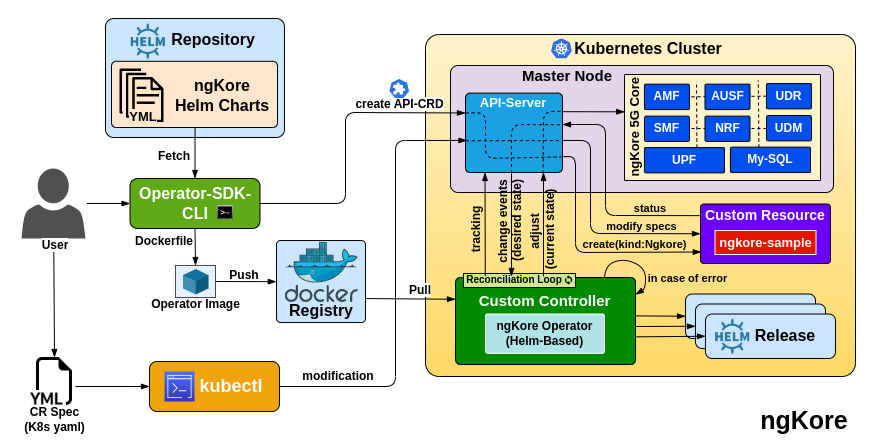
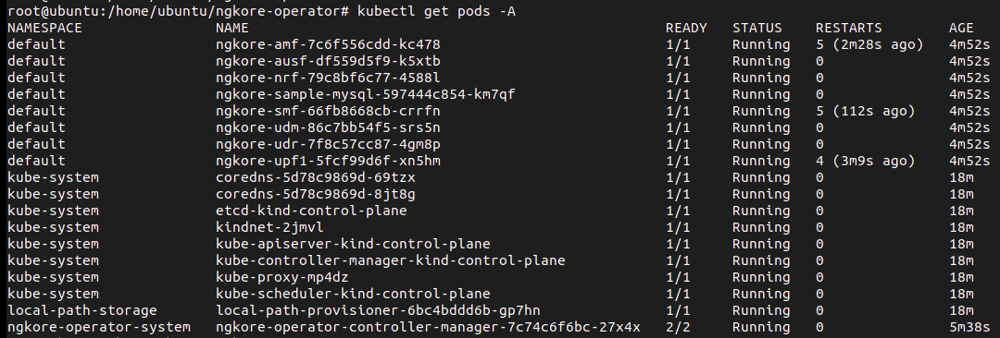
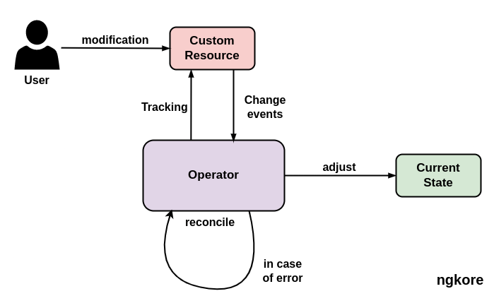

# 5G Core Operator

**Author:** [Nitin Rajput](https://www.linkedin.com/in/nitin-rajput-3a321114b/) & [Shubham Kumar](https://www.linkedin.com/in/chmodshubham/)

**Published:** June 5, 2023

1.  **Creating the API and Controller** - We first create a new
    CRD(*Custom Resource Definition*) API and a new Controller. This is
    done using the Operator SDK. We provide a Helm chart path that the
    Operator will manage. This Helm chart, essentially, is the blueprint
    for deploying the application we want to manage.
2.  **Fetching the Helm Chart** - The Operator SDK fetches this Helm
    chart from the repository during the API creation. The Helm chart is
    then stored locally in the Operator project.
3.  **Building the Docker Image** - Once the API and Controller are set
    up, we build the ngKore Operator Docker image and then pushed to the
    Dockerhub registry so it can be accessed and pulled into a
    Kubernetes cluster.
4.  **Applying the Operator\'s Deployment Manifest** - The Operator is
    now ready to be deployed to a Kubernetes cluster. We do this by
    applying the Operator\'s deployment manifest to the cluster using
    kubectl. The Operator is now running in the cluster.
5.  **Creating Instances of the Custom Resource** - We can now start
    interacting with the Operator by creating instances of the
    **ngkore** custom resource. These instances are defined in YAML and
    are applied to the cluster using kubectl. This YAML
    defines the desired state of our application.
6.  **Reconciliation Loop** - The Operator's controller constantly
    watches the ngkore custom resource for changes. If it detects a
    change, it performs the necessary actions to make the cluster
    reflect those changes. This is called the reconciliation loop.
7.  **Modifying the Custom Resource** - The 'spec' field in the CR
    corresponds to the values.yaml file in the Helm chart.
    When a CR is created or modified, the Operator deploys or updates
    the Helm chart using the configuration values from the CR.

    

8.  **Helm Releases** - Each time a CR is modified, a new release of the
    Helm chart is created with the updated configuration values. This
    release is a running instance of the chart and is stored in the
    cluster. This does not change the original Helm chart but instead
    creates a new instance (*release*) of the Helm chart with the
    updated configuration.

## Operator

Kubernetes Operators are software extensions to Kubernetes that make use
of custom resources to manage applications and their components. They
essentially automate the tasks of a human operator who would normally
have to manage a service or set of services.

Operators follow the principles of the Kubernetes design, namely the
Controller concept, which allows you to extend Kubernetes\'s
functionality without modifying the code of Kubernetes itself.

Operators introduce new types of resources into Kubernetes, and these
are defined using **CRDs** . These new resources are
application-specific and are understandable by the Operator; they
contain the information that the Operator needs to manage the
application.

The Operator includes a **Controller** which runs in a loop monitoring
the state of your application. It compares the desired state (*defined
by the custom resources*) with the actual state in the Kubernetes
cluster. If the actual state does not match the desired state, the
controller will execute the necessary steps to correct it.

### Benefits of Operator

1.  **Automating Deployment and Scaling** - Operators can simplify the
    process of deploying 5G NFs and their associated resources on
    Kubernetes. It automates the creation of Pods, Services, ConfigMaps,
    and other Kubernetes resources required for 5G NFs. They can also
    handle the auto-scaling of these resources based on various
    parameters like network load.
2.  **Managing Lifecycle** - Operators can manage the entire lifecycle
    of 5GNFs, including upgrades, rollbacks, and backup/restoration
    procedures. This can significantly simplify the management of 5G NFs
    and reduce the chance of human error during these processes.
3.  **Handling Failures** - Operators can monitor the state of 5G NFs
    and their associated resources, and take corrective actions when
    something goes wrong. This might include restarting failed Pods or
    initiating failover to a backup instance in the case of a severe
    issue.
4.  **Customization** - Since Operators extend the Kubernetes API with
    Custom Resources, they allow for deep customization of the managed
    software. This is especially useful in the context of 5G NFs, which
    can have complex configuration requirements.
5.  **Observability** - Operators can expose the managed software\'s
    metrics, logs, and other observability features, thus simplifying
    the integration with monitoring and alerting systems.
6.  **Integration** - Operators can integrate with other parts of the
    Kubernetes ecosystem, like service meshes, storage providers,
    security systems, etc.

### Use of Operator

1.  **Automated NF Deployment** - With a 5G Operator, you can automate
    the deployment of various NFs such as UPF, AMF, SMF, AUSF, NRF, UDM,
    etc. This makes the deployment process more efficient, less
    error-prone, and more scalable.
2.  **Lifecycle Management of NFs** - Operators are designed to manage
    the entire lifecycle of a resource. They can manage updates and
    upgrades of NFs, manage backups and restoration, and even handle
    decommissioning. This simplifies the day-to-day operations of 5G NF
    management.
3.  **Auto-Scaling and Load Balancing** - Depending on network traffic
    and resource utilization, Operators can automate the process of
    scaling the 5G network functions in or out. This ensures optimal
    utilization of resources and maintains high availability of
    services.
4.  **Network Slicing** - Operators can help automate the process of
    creating network slices. Each network slice is an isolated
    end-to-end network tailored to fulfill specific requirements. By
    automating this process, Operators can make it easy to deploy and
    manage multiple network slices for different use cases.
5.  **Handling Failures and Fault Management** - Operators constantly
    monitor the state of the resources they manage and can take
    automatic actions to handle failures. They can restart failed pods,
    recreate services, or even trigger failover mechanisms to maintain
    network service continuity.
6.  **Integration and Interoperability** - Operators can play a key role
    in ensuring interoperability of 5G network functions from different
    vendors by standardizing the deployment and management interfaces.
7.  **Automated Configuration Management** - Operators can manage
    complex configuration changes across multiple NFs, ensuring that
    changes are rolled out consistently and safely.
8.  **Service Assurance** - Operators can provide real-time monitoring
    and diagnostics of 5G NFs, allowing for proactive maintenance and
    fault detection.

By taking advantage of Operators, telecommunication providers can
simplify and automate many of the complex tasks involved in managing 5G
NFs. This leads to increased operational efficiency, reduced operational
costs, and improved service reliability.

### CRD

It stands for Custom Resource Definition. Kubernetes comes with several
pre-defined resources like Pods, Services, and Deployments that we can
create and manage. However, sometimes we might need to add new types of
resources that are specific to our application or infrastructure.
That\'s where CRDs come in.

A CRD allows us to create our own, custom resources that behave like
native Kubernetes resources. Once a CRD is created, users can create and
manage instances of this new resource using kubectl, just
like they would for built-in resources. CRDs are powerful because they
let us extend the Kubernetes API to fit our needs, while still
benefiting from the Kubernetes API\'s infrastructure, like its RESTful
design, CLI and UI integration, and lifecycle management.

### CR

A CR(*Custom Resource*) is an extension of the Kubernetes API that
allows to store and retrieve structured data. It\'s a way to introduce
our own API objects into our Kubernetes cluster to suit our
application\'s specific needs.

When we create a CRD(*Custom Resource Definition*), we create a new kind
of resource in our Kubernetes cluster. This new resource behaves like
any standard resource in Kubernetes (*like Pods or Services*), meaning
we can use kubectl to create, view, modify, and delete
instances of our custom resource.

### Importance of CRD and CR

CRDs and CRs in Kubernetes can play a pivotal role in the deployment and
management of 5G networks.

1.  **Network Functions Virtualization (NFV)**: 5G networks heavily rely
    on NFV, which involves running NFs as software on standard hardware.
    Kubernetes is an excellent platform for running these VNFs. CRDs can
    be used to define new types of resources for different VNFs, and CRs
    can then be created as instances of these new resource types. This
    allows for the easy deployment, scaling, and management of NFs,
    which is critical in a 5G context.
2.  **Service Meshes and Traffic Management**: Service meshes can be
    used to manage traffic between VNFs, providing features like load
    balancing, traffic routing, and security. These service meshes often
    use CRDs to define new types of resources for managing these
    features, and CRs can then be created to implement specific traffic
    management rules. This is particularly important in 5G networks,
    which need to handle a high volume of traffic and ensure that it\'s
    routed efficiently.
3.  **Custom Scheduling and Resource Allocation**: Different VNFs may
    have different resource requirements, and may need to be scheduled
    on specific nodes to meet these requirements. CRDs can be used to
    define new types of resources that specify these scheduling
    requirements, and CRs can then be created to specify the
    requirements for each VNF. This is crucial in 5G networks, which
    need to ensure that resources are allocated efficiently to handle
    the high data rates and low latencies that 5G promises.
4.  **Network Slicing**: One of the key features of 5G is network
    slicing, which allows for the creation of multiple virtual networks
    that operate on the same physical infrastructure. CRDs can be used
    to define new types of resources for these network slices, and CRs
    can then be created for each slice in our network. This is important
    in 5G networks, which need to support a wide range of different
    services, each with its own requirements.

In summary, CRDs and CRs provide the flexibility and extensibility
needed to manage the complex and diverse needs of 5G networks. They
allow us to define and manage custom resources that represent the
various components and features of a 5G network, extending the
functionality of the Kubernetes API to better suit the specific needs of
5G.