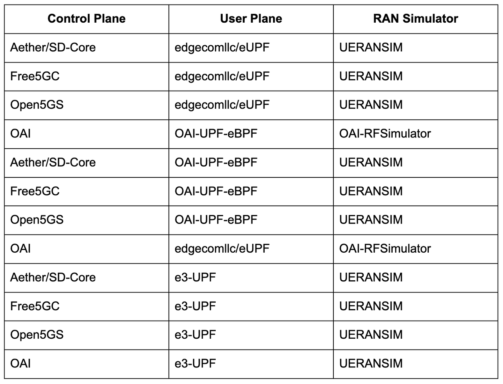

# HEXAeBPF: Interoperable eBPF-Defined 5G Core (eDC) Architecture

**Author:** [Shankar Malik](https://www.linkedin.com/in/evershalik/)

**Published:** July 3, 2025

> _Part 2 of 2: HEXAeBPF Series_

eBPF enhances the Linux kernel by allowing developers to add features without changing kernel code. It is vital for cloud-native environments, especially 5G networks, where it improves the User Plane Function (UPF) by enabling faster packet processing within the kernel. This eliminates latency issues caused by traditional UPF operations.

Traditionally, the UPF operates in user space, forcing packets through the kernel’s network stack—a process plagued by latency due to context switching, memory copying, and system call overhead. To address this challenge, HEXAeBPF was developed as an open source project under LF Networking's 5G Super Blueprints (5G SBP).

By leveraging eBPF, kernel bottlenecks can be bypassed, packet processing streamlined, and 5G’s full potential unlocked. This synergy between eBPF and 5G marks a new era of efficiency and innovation, paving the way for faster and smarter networks.

There are some open-source projects that enable eBPF integration with 5G cores.
For example: upf-bpf, OAI-UPF-eBPF, eUPF, etc.

The above projects seem interesting and promising to open source, even though they are using eBPF, which provides a new way of enhancing UPF throughput capability in 5G Core, which overall helps in many scenarios but along with the pros it comes with the main cons of complexity and feature limitations.

**The table below highlights the features currently missing in these projects:**

## From Challenges to Solutions: Transforming 5G Core with eBPF

To address these limitations, the following two eBPF-powered projects effectively bridge the gaps, offering tailored solutions, interoperability, and addressing key challenges in the 5G Core ecosystem.

1. **HEXAeBPF**

   HEXAeBPF brings interoperability and simplifies the integration and deployment process, offering one-click deployment capabilities.  
   It bridges the gap between complexity and accessibility, making it an ideal choice for developers for eBPF & 5G Core integrations.

2. **e3-UPF**

   e3-UPF (e3 stands for eBPF) addresses the limitations of existing projects while maintaining full 3GPP compliance.

## HEXAeBPF

HEXAeBPF provides openness and interoperability to the open source community.

 

HEXAeBPF is a Kubernetes (K8s) Operator designed to redefine how open-source 5G core networks are deployed and managed. By integrating and automating the deployment of Control Plane (CP) from Vendor A and eBPF-based User Plane (UP) from Vendor B, HEXAeBPF enables seamless, end-to-end 5G setup.

Whether as a telecommunications researcher, developer, or network operator, HEXAeBPF streamlines deployment procedures, enhances interoperability, and facilitates the advancement of 5G core network architectures. HEXAeBPF simplifies the integration and deployment process, offering one-click deployment capabilities.

  
**Figure 1:** Control Plane & eBPF User Plane Interoperability using HEXAeBPF

## HEXAeBPF Operator

HEXAeBPF Operator is a Kubernetes Operator that continuously monitors Custom Resources (CRs) that define the desired state of an application or component. When a user creates or updates a CR, the Operator detects the change through its watch loop. This triggers a reconciliation event. The Operator’s controller then evaluates the current cluster state against the desired state defined in the CR. Based on this comparison and the Operator’s reconciliation logic, it performs the necessary actions—such as creating, updating, or deleting Kubernetes resources—via the Kubernetes API to bring the system into the desired state.

  
**Figure 2:** HEXAeBPF Operator

### Key Features

- **Interoperable 5G Core Solution:** Integrates CP from one vendor with UP from another, offering unparalleled flexibility.
- **Zero Effort Deployment:** Automated deployment with no prior technical knowledge required.
- **One-Click Deployment (OCD):** A single command sets up the entire 5G core solution.
- **Interactive CLI:** User-friendly terminal interface for configuration and management.
- **E2E Connectivity:** Full integration with RAN simulators for end-to-end testing.
- **Open Source Accessibility:** Promotes collaboration and innovation in the telecom industry.

### Advantages

- **Interoperability:** Modular design allows seamless integration between various open-source CP and eUP components.
- **Efficiency and Speed:** eBPF-based UPF optimizes performance, while one-click deployment drastically reduces setup time.
- **Future-Ready:** Aligns with the dynamic nature of 5G, ensuring adaptability to modern network demands.
- **Open Source Collaboration:** A community-driven approach fosters continuous innovation in 5G core solutions.

## Current HEXAeBPF Supported Topologies

## Get Involved

HEXAeBPF is free and open source. Contribution is welcomed from anyone interested in advancing the open source telecom community.

- [HEXAeBPF GitHub Repository](https://github.com/ngkore/HEXAeBPF)
- [5G SBP Library Index](https://lf-networking.atlassian.net/wiki/spaces/LN/pages/15692042/5G+Super+Blueprints+Library)
- [HEXAeBPF 5G SBP Use Case](https://lf-networking.atlassian.net/wiki/x/DoCkG)

HEXAeBPF is an initiative to revolutionize the open source telecom community, and collaborating with the 5G Super Blueprint (5G SBP) Library provides more ground to grow.
