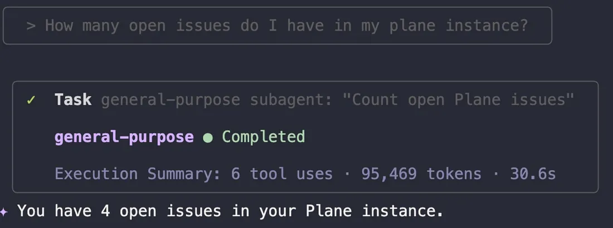
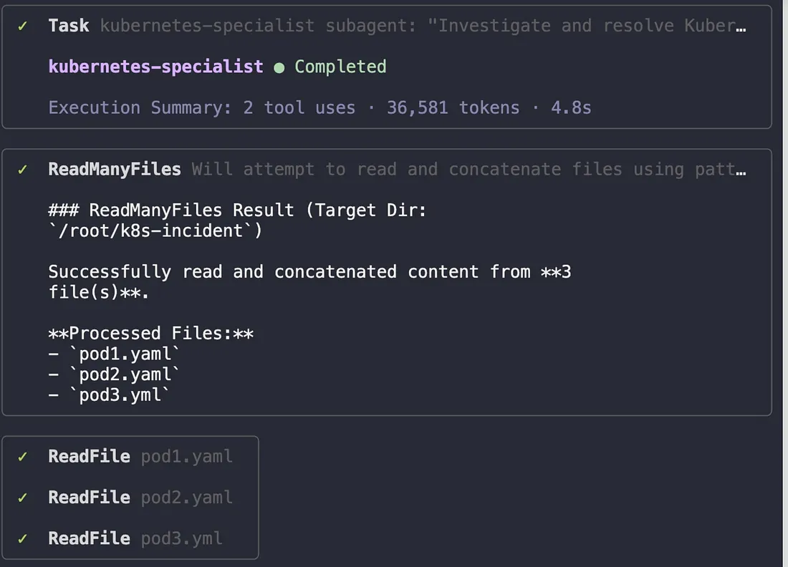
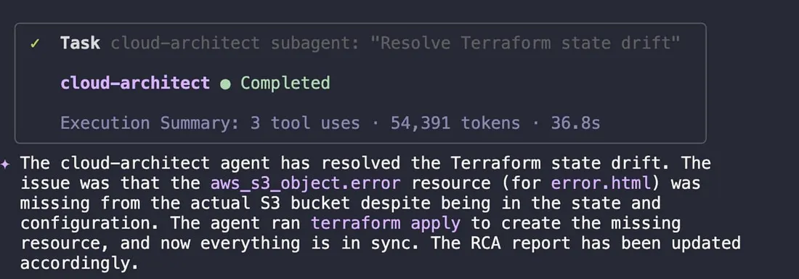

# AI DevOps — The AI Incident Commande
**Author:** [Megha](https://www.linkedin.com/in/megha-7aa3a0203/)

**Published:** Oct 27, 2025

In this blog series, I’ve been charting my journey into AI-powered DevOps — moving from basic diagnostics and RAG systems to building a full team of AI agents. But theory is one thing; putting it all to the test in a crisis is something else entirely.

The final day of the AI course was designed for exactly that. The scenario was a classic production nightmare: Kubernetes pods were stuck in a crash loop while significant Terraform drift was being reported. The mission wasn’t just to fix the problems, but to do it by orchestrating the AI tools and agents I had spent the week building.

This final post covers how I used an AI “incident commander” to delegate, resolve, and document a complex, multi-faceted outage, bringing the whole journey to a powerful conclusion.

## **My Strategy: The AI-Powered Response Team**
With the crisis established in the introduction, my approach was to fully leverage the AI-powered system I had developed throughout this course. My role shifted from a hands-on engineer to that of a strategic commander, directing a purpose-built AI team with the following structure:

- ***Qwen as the Orchestration Engine***: At the center of the operation, Qwen was responsible for interpreting my high-level commands and delegating the tactical execution to the appropriate specialist.
- ***Plane as the System of Record***: Integrated via MCP, Plane provided real-time visibility into the active incidents and served as the platform for our automated resolution updates.
- ***The Expert Subagents***: The core of the response team were the two specialists we built and validated on Day 4:
             1. K8s: The kubernetes-specialist, tasked with methodically diagnosing the CrashLoopBackOff errors and restoring service.

             2. TF : The cloud-architect, responsible for identifying the source of the Terraform drift and reconciling our production state.

This structure allowed me to manage the incident strategically, focusing on the resolution path rather than getting lost in the tactical details of any single issue.

## **Step 1: Assembling the Crisis Team**
Before diving into the production fire, the first step was to ensure my AI team was online and ready. I ran a quick check to list the installed agents and verify the connection to our Plane ticketing system.
```shell
# Verify available agents
qwen --prompt "List installed agents" 2>/dev/null
# Test Plane MCP Integration
qwen -y 2>/dev/null
How many open issues do I have in my plane instance?
```
The system confirmed three agents were active (cloud-architect, kubernetes-specialist, and general-purpose) and that it was connected to Plane, immediately reporting four open issues. The crisis team was ready for its assignments.


## **Step 2: Addressing the Kubernetes Outage**
The most critical issue was the application downtime caused by the crashing pods. I navigated to the relevant directory and delegated the problem to our Kubernetes expert.

```shell
cd /root/k8s-incident
qwen -y 2>/dev/null
```
**Prompt to the Kubernetes Specialist:**
```
Use the kubernetes-specialist agent to investigate and resolve pod failures.
- Analyze the pods in the default namespace for CrashLoopBackOff issues, resource constraints, and configuration errors. Pod manifest files can be found at '/root/k8s-incident'.
- Apply the necessary fixes and ensure all the containers within a pod are restored to Running state after remediation.
- Perform root cause analysis (RCA) and document findings.
- Save the detailed incident report to /root/k8s-incident/incident-report.md.
The agent immediately began its investigation, reading the YAML manifests for all three pods.
```


It quickly diagnosed the root cause:
- kk-pod1 had an invalid command causing it to crash,
- kk-pod2and kk-pod3 had resource or configuration issues preventing them from running properly.
The agent formulated a plan to fix all three.


After applying the fixes, the agent re-checked the pod status. Success!!! All pods were now in a stable running state, and the application was back online. The agent then completed its final task: documenting the entire process in a detailed incident report.


## **Step 3: Resolving Infrastructure Drift**
With the application back online, I assigned the next issue to the cloud-architect agent: reconciling the infrastructure drift.

*First, What is Infrastructure Drift?*

Before diving into the fix, it’s important to clarify what “infrastructure drift” actually means. In the world of Infrastructure as Code (IaC), your Terraform files are your single source of truth — they represent the desired state of your environment.Infrastructure drift occurs when the actual state of one’s live production environment no longer matches the state defined in their code.

Think of Terraform code as the official architectural blueprint for a house. Drift is what happens when someone makes a change on-site — like moving a wall or adding a window — without updating the blueprint. The blueprint is now wrong, and any future work based on it is at risk of causing serious problems.

This is precisely the problem our cloud-architect agent was designed to solve: to programmatically detect this drift, report on it, and bring our infrastructure back into alignment with our code.
```shell
cd /root/terraform-static-site
qwen -y 2>/dev/null
```

Prompt to the Cloud Architect:

```
Use the cloud-architect agent to:

- Analyze the Terraform project in /root/terraform-static-site/ for infrastructure drift.
- Detect unmanaged or drifted resources and identify differences between Terraform state, configuration, and actual infrastructure.
- Reconcile the drift by executing the correct Terraform commands that bring the project back in sync.
- Generate a detailed Root Cause Analysis (RCA) report that explains:
  - What drift was detected
  - The probable causes
  - The corrective actions taken
  - Recommendations for preventing future drift

Save this RCA report as /root/terraform-static-site/terraform-drift-rca.md.
Press enter or click to view image in full size
```


This is a classic example of dangerous drift — our infrastructure was in a state where it could not properly serve error pages to users, and our code was blind to the problem.

The agent’s solution was simple and direct: it ran terraform apply to create the missing error.html object, instantly bringing our live infrastructure back into alignment with our code.

## **Step 4: Closing the Loop with Automated Documentation**
With both incidents resolved, the final, and often forgotten, step was to close the loop. I prompted the AI to:

With both incidents fully resolved, it was time for the final, and often forgotten, step of any incident: closing the loop. Manually writing ticket updates and post-mortem summaries is tedious, error-prone, and often gets skipped in the rush to move on.

This is where the genral-purpose agent shines. I gave it one final task:

Prompt for Final Reporting:
```
Update our Plane tickets with concise, professional comments.
Summarize the Kubernetes resolution from /root/k8s-incident/incident-report.md 
and the Terraform drift resolution from /root/terraform-static-site/terraform-drift-rca.md.
After updating the tickets, concatenate both RCA markdown files into a single, comprehensive executive-summary.md file for the CTO.
```


## **Final Thoughts: A New Operating Model for DevOps**
This five-day journey through the KodeKloud AI course has fundamentally reshaped my perspective on managing complex cloud environments. I began this blog series exploring AI as a clever assistant. I’m ending it with the conviction that AI is the platform on which we will build the next generation of resilient, automated, and self-healing systems.

This series charted a clear path of that evolution. I progressed from using AI for smarter diagnostics (Day 1) and organizing documentation with RAG (Day 2), to integrating it with live cloud services for security audits (Day 3). From there, I learned to build a scalable team of specialized AI agents (Day 4), which all culminated in the final capstone: leading an AI-powered incident response.

The capstone lab was the ultimate proof of this new model. A complex production incident, which would traditionally require hours of manual investigation and late-night calls, was resolved methodically by the AI-led team. The key was not just automation, but orchestration — directing specialized agents to work in concert towards a common goal.

The true impact here isn’t just about speed; it’s a move away from a reliance on siloed human expertise for incident response. By codifying knowledge into autonomous, reusable agents, we create a system where best practices are applied consistently, and every resolution makes the entire system more reliable.

This journey has made one thing crystal clear: *the future of DevOps is not about simply using AI. It’s about building with it.*
