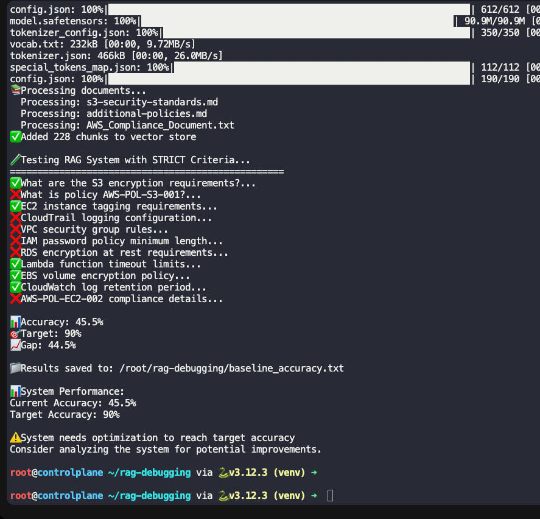
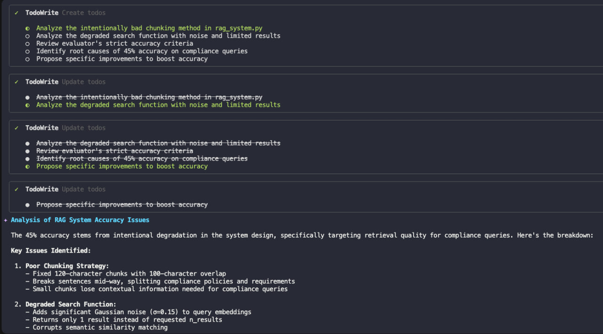
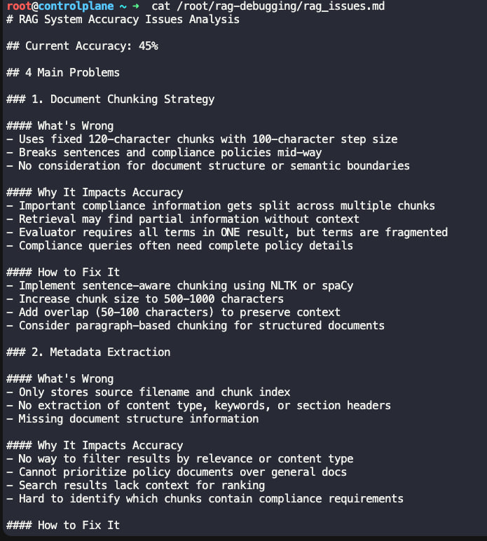

# AIOps In Production

**Author:** [Wafi Hasan](https://www.linkedin.com/in/wafi-hasan-334b3520a/)

**Published:** Sept 19, 2025

Production alerts at 2 AM is really like babysitting a toddler who just ate a load of junk food:  
Unpredictable, noisy and to be honest capable of causing catastrophic damage in seconds.

Well in this blog I will try and walk you through one of the possible solutions to solve your problem. (FYI the production problem ofcourse, as far as the toddler I would say no junk food after 4.)

In this blog, we’ll explore how *AIops* can help you with the late night fights into smooth, almost boring operations. And trust me, in production, boring is good.

## **So what is AIops?** 

It stands for Artificial Intelligence in IT operations, as the name suggests we are using the capabilities of AI to manage and troubleshoot your whole IT infrastructure,  automating critical tasks like performance monitoring, microservices scheduling, and data backups.

It utilises techniques like *machine learning (ML)* and *natural language processing (NLP)* to boost IT operational efficiency.  
By collecting and analyzing data from multiple sources, it will deliver proactive, real-time, and actionable insights that help your teams plan ahead.  
Think of AIOps as having your own weather forecaster for IT infrastructure, except this one actually gets the prediction right.

Now let us tackle the more important question;

## **Why AIOps?**

The way modern IT environments evolve, we see that everything now generates data from your applications to the remote sensors deployed on a remote village in Himalayas, data is pouring in 24/7 and is only going to increase, complexity keeps climbing, and the rate of change of IT architectures makes even the most trained engineers google YAML syntax at 4 in the morning.

Now who is there to make sense of this data? Being updated with the latest microservice architectures and syntaxes?   
That is why we need AIOps. It isn’t just a “fancy tool” you have, it has the capability to be the backbone of running reliable and scalable operations in a chaotic world. 

Here are just a few things that integrating AI into your IT operations would do for you:

**Reduce Operational Costs**

It has the capability to extract actionable insights from massive data, this will ease the burden on IT teams from repetitive grunt work so they can focus on other critical tasks.   
It also keeps cloud bills lean by preventing inefficiencies and costly errors.  
   
**Reduce Problem Mitigation Time (MTTR & MTTD)** 

Using insights from data and event correlations it will highlight what actually matters.  
It uses ML algorithms to separate signals from noise, thus we have fewer false alarms, faster incident resolution and happy customers.

**Enable Predictive Service Management**

As we mentioned before it will analyze historical and real-time data to predict issues before they cause outages.  
It will detect patterns invisible to humans leading to fewer “surprise” incidents.

**Streamline IT Operations** 

Aggregates data from multiple sources into one single, intelligent framework.  
It will Automate coordination between your systems leading to fewer human and integration errors.  
Thus giving IT teams one version of the truth instead of 15 dashboards and a headache.

## **How Does AIops Work?**

We’ll chunk down the phases into manageable portions, just like the comforting meals your mum used to prepare, making it easier to chew through and grasp the concept.

**1.) Observing Phase:**

The first step would be to collect data from multiple sources and bring them together into a unified repository. We also have the option to add tags and meta data to make it easy to access and retrieve.   
AIOps systems continuously monitor the data to identify patterns and anomalies, using AI-driven correlation techniques, the system links related events across different sources, establishing a holistic view of IT operations. 

Now Once data is integrated we have a foundation to run machine learning models to detect deviations from normal operational behavior, known as anomalies. Pattern recognition helps distinguish between typical fluctuations and signs of potential issues, enabling proactive response. 

**2.) Engaging Phase:**

Now this is where Human intervention may be beneficial and we will discuss this later on in the blog.  
Operations teams reduce their dependencies on conventional IT metrics and alerts. Instead they use AIOps analytics to coordinate IT workloads on multicloud environments.  
They get a one stop dashboard where they are able to see all the relevant metrics and how they are correlated.  
After finding out the anomaly you need to find and apply a fix that is long term and stable. 

**3.) The Act Phase:**

In this phase AIOps technologies take actions to improve and maintain IT infrastructure, the goal is to automate the process so in future the team can process on mission critical tasks.  
The IT team can trigger automated workflows based on the analytics that ML algorithms generate. For example, if an anomaly indicates a possible server overload, AIOps might initiate automated scaling or resource reallocation. 

**4.) Continuous Learning and resource allocation:**

AIOps keeps learning from incidents and refines its functionalities.  
As more data gets processed, machine learning models will improve, allowing AIOps to adapt to new patterns. This enables the system to respond to new, unexpected scenarios 

Since we are clear on what is AIops, its importance and how it works, let us move ahead and enter the crux of this blog, the **use cases of AIops** in production:

**Performance Monitoring**   
Modern applications rely on complex microservices based architectures which are evolving day by day, running and scaling across multiple cloud environments at one time. Traditional methods often struggle to capture metrics in such a dynamic architecture.  
AI-driven monitoring helps software teams gather, analyze, and compile relevant metrics at scale, providing a clearer picture of the whole ecosystem

**Observability**  
AIOps reduces noise and false alarms, extracting and providing you with meaningful patterns from vast amounts of data, allowing teams to focus on what truly matters.

**Faster root cause analysis**  
Using AI/ML technologies we can efficiently determine the root cause of incidents by rapidly processing large datasets and mapping out relations between multiple potential factors.   
By adopting AIOps, organizations can go beyond surface-level alerts to identify the true source of system issues. This enables preventative actions at the root to eradicate the issue once and for all, moreover through automated responses we can ensure the problem doesn’t repeat or is handled automatically if it does.

**Anomaly Detection though Predictive insights and early warnings**  
AIOps provides real time monitoring and predictive insights to quickly detect deviations and automate corrective measures.

**Cloud Automation and Optimization**  
Managing cloud applications requires agility to handle interdependencies, and AIOps solutions help provision and scale compute resources automatically.  
For example, AIOps tools can monitor cloud usage and dynamically increase capacity to handle traffic spikes.

**Development Support**  
DevOps teams leverage AIOps to improve code quality, automate reviews, enforce best practices, and catch bugs earlier in the development cycle.  
For example, Atlassian uses Amazon CodeGuru to reduce anomaly investigation.

## **AIops & GenAI**

Since this is a blog related to AI we ofcourse had to mention Gen AI.  
Generative AI can help you navigate your observability platform and provide further insights and guidance into what you’re seeing with a simple query. Consider these use cases:

- Query Gen AI to get an idea of the metric you observe to provide you with more information about the data  
- The generative AI tool can even go one step further and synthesize the information you see on your platform to generate a neat report, actions that can be taken or a visualization for you.  
- With its ability to explain and synthesize, the generative AI tool can help improve your team’s efficiency. For example, if your code is eating up a lot of CPU, you could query the generative AI tool to use code profiling data to identify resource intensive functions and optimize them to improve resource usage, and down the line, reducing costs

Now I understand what will be going through your mind, this blog is only theoretical. Where are the real world applications of AIops?   
So I’ve pulled together a few examples, one with real numbers and a hands-on tutorial I did myself (yes I do code\!  keep an eye out, that blog is also dropping soon). 

## **Big Panda:**

First let us begin with the company Big Panda which provides AIops solutions.  
Their customers have reported reduced alert noise by **80%** and MTTR (Mean Time To Resolution)  by **25% within 90 days.**  
50% of their adopters exceed **20% in saving** and 30% have doubled their cost savings.

One of their customers Gamma was reluctant at first but a test project led to **93% reduction** in alert noise. For context, that’s higher than the sum of my math percentages across three grades\!

## **QWEN integration with Kubernetes Infrastructure:**

There is a RAG system setup for AWS compliance documents and current accuracy is around 45% which needs to be raised up to 90%.  
We used QWEN which is integrated with our k8s cluster to do so, here is the prompt we used:

```console
Analyze the RAG system at /root/rag-debugging/rag-system/rag_system.py
The system is only achieving 45% accuracy on compliance queries.

1. Identify the 4 main problems causing poor accuracy
2. For each problem, explain:
   - What is wrong
   - Why it impacts accuracy
   - How to fix it
3. Create a markdown report and save it as /root/rag-debugging/rag_issues.md

Focus on:
- Document chunking strategy
- Metadata extraction
- Search methodology
- Query processing
```


*Image 1: Running Test to get RAG accuracy*

This was before the result, the whole process and integration is for another blog so for now we will just move over to the essentials.

**QWEN in Action:**


*Image 2: QWEN in action after passing the above prompt, we can see in the image it has identified the key issues*


*Image 3: QWEN Giving us output to the prompt “ Whatever you have done till now give a short summary”*

Below is a section of the README file which QWEN generated for us to improve the efficiency of our system


*Image 4: README file QWEN generated for us*

It has documented the steps we need to take to improve the efficiency of the RAG system, based on these we can even give it prompts to optimize the system for us, so instead of spending hours of manual labour in finding the issues we found them in minutes\!  
This is just a glimpse of the power of AIops.

I want to end this blog by clearing out a common misconception people have when we talk about AI.  
Entrepreneur Peter Thiel mentions in his book “ Zero to One” that the most successful companies today weren't those who tried to replace human beings, but ones who utilised the best out of machines and humans.   
It is not a question of  “or” but "Humans and AI”.

AIops will be far more effective with human insights and direction, in production environments it will be skilled humans who govern the decisions and leverage AI for the cumbersome tasks.  
AIOps is not here to replace humans but to co-exists in harmony, Sounds like the perfect marriage, doesn't it\! 👀

> **NOTE:** Some images and concepts in this blog are sourced from KodeKloud’s AI Training Course. All rights belong to their respective owners.
