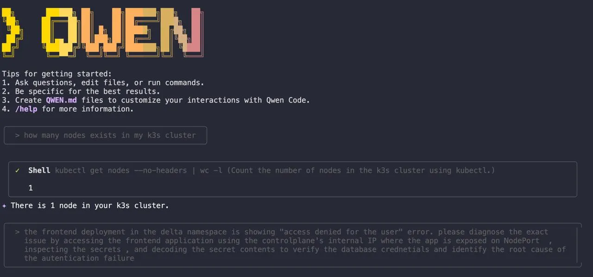
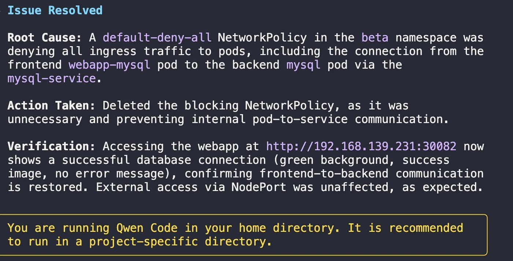

# From Broken Pods to Actionable Prompts

**Author:** [Megha](https://www.linkedin.com/in/megha-7aa3a0203/)

**Published:** Oct 07, 2025

## Setting the Stage: A New Approach to AI in DevOps

I recently completed KodeKloud’s “AI Free Week,” a fantastic, hands-on course that transformed my perspective on AI-powered DevOps. In this series, I’ll document my day-by-day journey, sharing the concepts I learned, the challenges I overcame, and the crucial shift from simply asking an AI for help to empowering it with the tools to take direct, auditable action.

Our primary tool for the week was **Qwen**, a command-line AI assistant built for coding and operations. This series will follow my progress as I learned to use it to troubleshoot and manage real infrastructure, moving beyond theory and into practical application.

Throughout this journey, we will explore how to:

- Give an AI secure, auditable access to operational tools like kubectl and cloud APIs using the Model Context Protocol (MCP).
- Build an intelligent knowledge base by transforming internal documentation into a reliable source of truth with Retrieval-Augmented Generation (RAG).
- Assemble and orchestrate a team of specialized AI agents to automate complex workflows, from optimizing Dockerfiles to managing a full incident response.

Ultimately, this series is about the practical steps involved in moving from manual, reactive work to building an intelligent, automated system. It’s a roadmap for anyone looking to understand how AI is fundamentally changing the way we build, secure, and operate software.



## About Qwen (how I used it)

Qwen is a coding‑optimized model family with a terminal‑first agent called `Qwen Code` that can read and edit files, run tasks, and automate workflows directly from the CLI.

Qwen3‑Coder powers agentic coding, enabling structured tool use and longer reasoning chains for development and operations work.

When paired with the Model Context Protocol (MCP), Qwen calls only the tools exposed through standardized, policy‑controlled connectors, giving auditable, least‑privilege access to infrastructure.

This design goes beyond generic chat systems by executing actions inside the working directory and shell rather than stopping at textual suggestions.

## The two models I ran

- `qwen3‑coder‑plus`: handled deep debugging, complex analysis, and multi‑step refactors with stronger reasoning depth.

- `grok‑code‑fast‑1`: delivered low‑latency answers for quick checks and real‑time tool loops.

`Operating safely with MCP`: Define only the tools and scopes required for the task, enforce least privilege on each connector, and rely on MCP’s audit trail for every request and response.
Use a confirm‑before‑execute pattern for mutating actions so plans are reviewed before Qwen invokes tools against live systems.

## Getting a Great Answer: The Prompting Method I Learned

Throughout the week, I learned that getting great results from an AI like Qwen isn’t magic — it’s about giving it great instructions. A vague prompt leads to a vague answer. A precise, context-rich prompt leads to an actionable fix.

Here is the simple, step-by-step workflow I developed for crafting prompts that get results.

1. `State Your Goal First and Be Specific`: Instead of asking, “Fix my pod,” try a more precise goal like, “Diagnose why the ‘payment-service’ pod in the ‘prod’ namespace is crash-looping and suggest a kubectl command to fix it."

2. `Provide Key Context`: Give the AI the same critical information a human colleague would need. This includes details like Kubernetes cluster versions, namespaces, resource names, and any specific error messages you’re seeing. The more relevant context you provide, the less the AI has to guess.

3. `Separate Your Instructions from Your Data`: When including logs, code snippets, or error messages, use formatting like triple backticks (```) to separate them from your instructions. This helps the AI clearly distinguish between the task you’re asking it to perform and the data it needs to analyze.

4. `Request a Plan Before Action`: For any task that involves making changes to your system, always ask for a plan first. “First, show me the commands you plan to run and explain your reasoning. Wait for my confirmation before executing.” This keeps you in control and makes every action auditable.

5. `Iterate from Broad to Specific`: You don’t always need the perfect prompt on the first try. Start with a broad query like, “Show me the status of pods in the ‘dev’ namespace.” Based on the output, you can then narrow your focus with a follow-up prompt, such as, “Describe the events for the ‘api-gateway’ pod that is showing an error.”

This iterative process of refining your questions based on the AI’s feedback is one of the most powerful ways to use these tools effectively.


That's an example of a good prompt in the above image.

## Day 1: A Tale of Two Bugs and One AI Assistant

The first day of my KodeKloud AI course kicked off with a scenario that felt all too real: a critical production outage. The company’s e-commerce site was down, and every passing minute meant more lost revenue. The team had been trying to solve the problem for hours, but the generic AI suggestions they were getting from their usual tools were leading them in circles.

My mission was to use Qwen, an AI assistant that has direct access to the live Kubernetes environment via kubectl. This, I would soon learn, makes all the difference.

## The First Clue: A Deceptive “Access Denied” Error

The most obvious problem was an “Access denied for user” error. The frontend couldn’t connect to the database. This seems like a simple credential issue, right? That’s what a generic AI would tell you. “Check your username and password,” it would say.

But the real issue was more insidious. It wasn’t that the credentials were wrong; it was that the Kubernetes Secret storing them was corrupted. The base64 encoding was invalid, a subtle problem that a text-only AI would never be able to spot because it can’t actually inspect the Secret.

This is where having a tool like Qwen felt like a superpower. I didn’t have to guess. I gave it a clear, direct prompt:

```console
The frontend deployment in the delta namespace is showing
'Access denied for user' error. Please diagnose the exact issue by:

1. Accessing the frontend application using the controlplane's internal IP
   (where the app is exposed on NodePort).
2. Inspecting the Kubernetes Secrets.
3. Decoding the secret contents to verify the database credentials
   and identify the root cause of the authentication failure.
```

This prompt is a great example of the context-rich, goal-oriented approach I learned in the course. It doesn't just describe the problem; it tells the AI exactly what to investigate and how.


Qwen got to work, and because it had direct access, it was able to decode the Secret and immediately identify the root cause: the application was trying to authenticate with a user that didn't exist in the database.


The investigation revealed that the application was trying to connect to the MySQL database using the username `sql-user`, but the database itself only had the `root` user configured. The Kubernetes Secret was pointing to a non-existent user.

With that clarity, the fix was simple. Qwen updated the Secret with the correct user, and just like that, the first fire was put out.

## The Second Twist: The Invisible Network Wall

But we weren’t out of the woods yet. The database was now connected, but the frontend still couldn’t communicate with the backend API. This felt like a networking issue, another area where generic advice often falls short. “Check your firewall rules,” a typical AI might suggest.

Again, I turned to Qwen, this time asking it to investigate the cluster’s network policies.


In moments, it found the culprit: a `default-deny-all` NetworkPolicy was in place, acting as an invisible wall between the pods. It was a simple configuration error, but one that can be incredibly frustrating to find manually.

After I confirmed the action, Qwen deleted the blocking policy, immediately restoring communication.



## My Key Takeaway from Day 1

This experience was a powerful reminder that the real value of AI in DevOps isn’t just about getting suggestions — it’s about getting answers. The difference between a tool that can only talk about your system and one that can actually interact with it is the difference between a three-hour outage and a ten-minute fix.

The key, I realized, is that context is everything. By giving the AI direct, secure access to the environment, you’re giving it the context it needs to move beyond generic advice and provide precise, actionable solutions. Day 1 taught me that the future of our industry lies in building these intelligent, context-aware partnerships between engineers and AI.

> Stay tuned for Day 2, where I’ll dive into building a Retrieval-Augmented Generation (RAG) system to create a smart, searchable knowledge hub.
