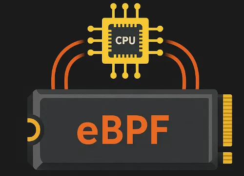

# Redefining Data Processing with eBPF in NVMe SSDs

**Author:** [Khushi Chhillar](https://www.linkedin.com/in/kcl17/)

**Published:** June 15, 2025

## Introduction

Computational storage represents a paradigm shift where storage devices participate in data processing operations rather than serving solely as passive storage repositories. This approach implements real-time filtering, searching, and computational tasks directly within the storage controller, eliminating data movement overhead and improving system efficiency.

eBPF offloading to computational storage devices enables sophisticated data processing capabilities at the storage layer, fundamentally transforming traditional storage architecture models.

## Traditional Storage Architecture Limitations

Contemporary storage systems require full data retrieval for processing operations. For example, when performing file metadata searches, traditional systems must:

1. Read all target files from the storage device
2. Transfer data to system memory (RAM)
3. Process data using main processor resources
4. Return processed results to the application

This approach creates significant performance bottlenecks due to data movement overhead, memory bandwidth consumption, and processor resource utilization for basic filtering operations.

## Computational Storage Architecture

Computational storage implements data processing capabilities directly within storage controllers. Rather than transferring all data to system memory, the storage device performs filtering and processing operations internally, returning only relevant results to the requesting application.

This architecture model eliminates unnecessary data movement while providing significant improvements in system performance and energy efficiency.

## eBPF Integration with Storage Controllers

eBPF (Extended Berkeley Packet Filter) provides a lightweight, secure, and efficient programming framework executable within hardware components such as storage devices.

eBPF programs offer the following capabilities:

- Execute specific computational tasks including data filtering and analysis
- Operate within sandboxed environments ensuring system stability
- Support dynamic updates and reconfiguration for new processing requirements

## eBPF-Enabled NVMe Storage Implementation

Recent research developments have successfully demonstrated eBPF program execution within NVMe SSD controllers, enabling computational capabilities at the storage device level.

This implementation provides the following operational capabilities:

- Data preprocessing prior to CPU processing
- Source-level data filtering operations
- Basic analytical functions including counting, sorting, and metadata tagging
- Reduced latency, memory utilization, and power consumption

## Case Study: Photo Search Optimization

**Traditional Approach:**

- Complete dataset transfer of 10,000 photos to system memory
- Sequential CPU-based filtering operations
- High latency and energy consumption

**eBPF-Enhanced Approach:**

- eBPF execution within SSD controller
- Device-level filtering by temporal metadata
- Selective data transfer of relevant results (e.g., 50 photos from 2023)

This approach demonstrates significant improvements in processing speed, resource utilization, and system efficiency.

## Application Domains and Use Cases

**Media Streaming Services**

- Real-time video transcoding within storage devices
- Optimized content buffering mechanisms
- Real-time user behavior analytics

**Mobile Computing**

- Automated media organization using facial recognition algorithms
- Intelligent cloud backup optimization
- Power-efficient computational offloading

**E-commerce Platforms**

- Accelerated product search capabilities
- Real-time review processing and filtering
- Enhanced data update mechanisms

## Delilah Project

Researchers at the IT University of Copenhagen developed the first functional prototype of eBPF computational storage, designated as the Delilah system. This implementation demonstrates the practical viability of secure eBPF execution within NVMe SSD controllers.

The Delilah project provides empirical validation of eBPF computational storage concepts through working prototype demonstration.

## Technology Adoption Timeline

**Near-term (2-3 years)**

- Computational storage deployment in enterprise data centers
- Development frameworks for storage-aware eBPF programming

**Medium-term (3-7 years)**

- Consumer device integration in laptops and mobile platforms
- Performance optimization for streaming and file management applications

**Long-term (7-10 years)**

- Industry-wide standardization of computational storage
- Expansion to IoT and edge computing devices

## Technical Benefits and Impact

- Reduced latency for file access and search operations
- Improved energy efficiency through minimized data transfer requirements
- Enhanced application performance through intelligent computational offloading

## Implementation Challenges

- Paradigm shift requiring storage-aware programming methodologies
- Initial cost premium for early computational storage devices
- Industry standardization requirements for interoperability across vendors

## Industry Development Initiatives

Major technology companies and emerging startups are actively developing computational storage solutions for:

- Enterprise data centers for cloud infrastructure optimization
- Personal computing devices for enhanced user experience
- Mobile and edge computing platforms for AI processing and power efficiency

## Conclusion: Computational Storage Paradigm

Computational storage represents a fundamental shift from passive storage architectures to intelligent, processing-capable storage systems. This evolution enables:

- Active data filtering and processing capabilities
- Autonomous computational decision-making
- Optimized system performance and energy efficiency

The transition from traditional data retrieval models to intelligent data processing demonstrates the evolution from:

- Complete dataset transfer for external processing
- Selective, preprocessed data delivery based on computational requirements

## Future Considerations

The computational storage paradigm represents a significant advancement in data processing architecture, transitioning from passive storage repositories to intelligent computational platforms capable of autonomous data processing and filtering operations.

This technology evolution indicates a broader shift toward distributed intelligence within computing infrastructure components.

## References

- [Delilah: eBPF-offload on Computational Storage](https://dl.acm.org/doi/10.1145/3592980.3595319)
- [IT University of Copenhagen — Delilah Project](https://pure.itu.dk/en/publications/delilah-ebpf-offload-on-computational-storage)
- [Delilah GitHub Repository](https://github.com/delilah-csp)
- [NVMe Computational Storage Feature Release — Official announcement](https://nvmexpress.org/nvm-express-announces-the-release-of-the-computational-storage-feature/)
- [SNIA Computational Storage Standards — Technical specifications](https://www.snia.org/educational-library/nvme-computational-storage-update-standard-2022)
- [The Register: NVMe Computational Storage Update](https://www.theregister.com/2024/01/17/nvme_specs_get_an_update/)
