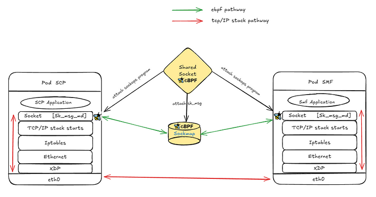
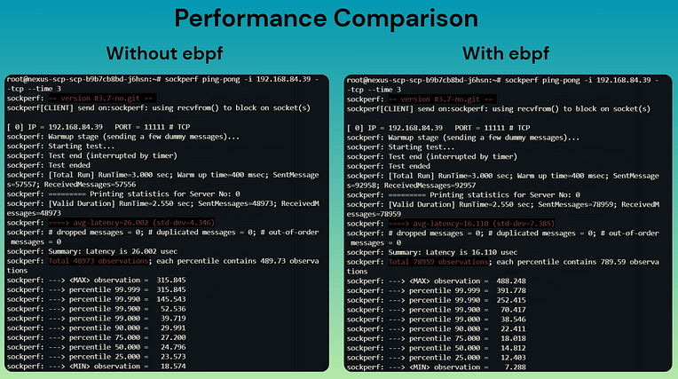

# Shared Socket: Enhancing Kubernetes Pod Communication with eBPF

**Author:** [Satyam Dubey](https://www.linkedin.com/in/satyam-dubey-142598258/) & [Nikhil Jangid](https://www.linkedin.com/in/nikhil-jangid-ab6625269/)

**Published:** July 19, 2025

## Introduction

Efficient pod-to-pod communication is central to high-performance Kubernetes deployments, especially in data-intensive and low-latency domains such as AI/ML pipelines, telecom (5G/6G) cores, and high-frequency trading. The traditional networking stack introduces overhead—context switches, memory copies, iptables traversals—that can contribute substantial latency. For intra-node communication, these inefficiencies are especially painful.

 

**Problem Statement:**

How can we bypass the overhead of the kernel networking stack to enable high-speed, low-latency socket communication between containers and pods?

## What is Shared Socket?

Shared Socket is an eBPF-based innovation that enables direct, high-speed TCP messaging between containers or pods residing on the same physical node. Leveraging eBPF sockmaps, it bypasses the conventional network stack for intra-node traffic, providing kernel-accelerated, low-latency communication.

## Architecture Overview

Shared Socket operates through two primary eBPF programs:

- **`sockops` program** (attached to cgroups):  
   Captures TCP socket events (`connect()`, `accept()`) and dynamically updates the sockmap with active TCP sockets.

- **`sk_msg` program** (attached to the sockmap):  
   Redirects messages in-kernel between sockets using `bpf_msg_redirect_hash()`, ensuring kernel-bypass for message transfer.

## How it Works

1. **CLI Launch:**  
   The user invokes the Shared Socket CLI with Kubernetes container names.
2. **Sockops Attachment:**  
   The CLI locates each container’s cgroup and attaches the `sockops` eBPF program. Sockets created by the container are auto-registered in the global sockmap.
3. **sk_msg Redirect:**  
   When data is sent across a registered socket, the `sk_msg` program intercepts and redirects the message in kernel, bypassing much of the networking stack.
4. **Userspace CLI & Observability:**  
   Optional control-plane tools collect metrics, observe socket/TCP events, monitor connection states, redirects, and can implement load-balancing between pods.

## Limitations and Requirements

- **TCP Only:** Currently supports only TCP. UDP/QUIC support would require different BPF hooks.
- **Same Hardware Requirement:** Both communicating containers must reside on the same physical node.
- **Limited Packet Inspection:** Standard tools (`tcpdump`) will not see intra-socket traffic, requiring eBPF tracing or logging.
- **eBPF Support Needed:** Kernel must support `sk_msg`, `sockmap`, and `sockops`. Verify using `bpftool feature`.

## Use Cases

- **Machine Learning Pipelines:**  
   Accelerate direct inference data transfer across services (model servers, preprocessors, aggregators).

- **Kubernetes Pods:**  
   Sub-millisecond communication between pods on the same node, bypassing IP routing.

- **Service Mesh Offload:**  
   Eliminate sidecar proxies for intra-node traffic, letting eBPF provide lightweight L7 logic.

- **5G/6G Telco Core:**  
   Low-latency, high-throughput messaging between components such as SMF, AMF, SCP, and UDM.

- **High-Frequency Systems:**  
   Speed up intra-node TCP-based workloads.

- **High-Throughput Microservices:**  
   In setups where multiple containers within a pod or node communicate (e.g., streaming, real-time, in-memory data), Shared Socket removes kernel-user-kernel roundtrips, reducing latency and resource overhead.

## Performance and Benchmarking

To evaluate the real-world impact of the Shared Socket approach, benchmarks and demonstrations are available on GitHub at [Satyam-git-hub/Shared-socket-Metadata](https://github.com/Satyam-git-hub/Shared-socket-Metadata). Users can also access demo materials, including videos, by cloning the repository.

For comprehensive performance evaluation, the Shared Socket mechanism was tested in the context of a 5G Core deployment using RKE2, a CNCF-certified Kubernetes distribution tailored for production environments.

The benchmark focused on communication between two vital components of the 5G Core:

- **SMF (Session Management Function)**, operating as the `sockperf` server
- **SCP (Service Communication Proxy)**, acting as the `sockperf` client

Network latency and throughput were measured using [Sockperf](https://github.com/Mellanox/sockperf), a specialized tool for socket performance analysis. Comparison was made between classic socket-based networking and the eBPF Shared Socket implementation utilizing sockmap.

**Benchmark Results:**

**Key Insights**

- Message throughput increased by ~60% using Shared Socket.
- Average latency was reduced by ~38% (from 26.002 µs to 16.110 µs).
- Standard deviation and tail latencies were slightly higher, which is expected given the denser and burstier traffic handled at higher throughput.

## Further Developments

Shared Socket offers significant opportunities for further optimization and innovation, including:

- **Custom Load Balancing via `sk_msg`:**  
  Implementing round-robin, hash-based, or QoS-aware distribution logic directly within the sk_msg program to route messages across multiple endpoints.

- **Per-Socket Metrics Collector:**  
  Maintaining fine-grained connection-level telemetry in dedicated BPF maps, with the potential for integration with metrics systems such as Prometheus.

- **Access Control / Authorization Layer:**  
  Establishing policies to determine which sockets have access to the shared sockmap, enforceable by identity, label, or real-time metadata.

## Conclusion

Shared Socket represents an advancement in programmable networking for Kubernetes workloads, enabling near line-rate, kernel-bypassed communication between containers on the same node. By eliminating overhead from the kernel networking stack, substantial gains in speed and efficiency can be achieved with standard eBPF features, requiring no kernel modules or custom drivers.

 

This technology is immediately deployable in Kubernetes clusters and paves the way for deeper innovations in pod-to-pod communication and resource-efficient cloud-native networking.
