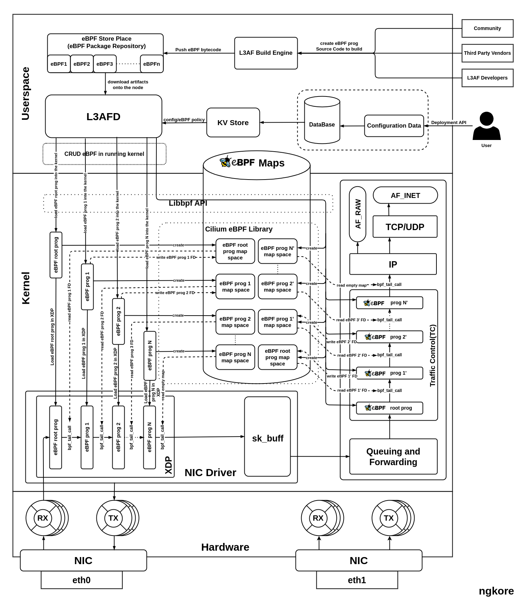
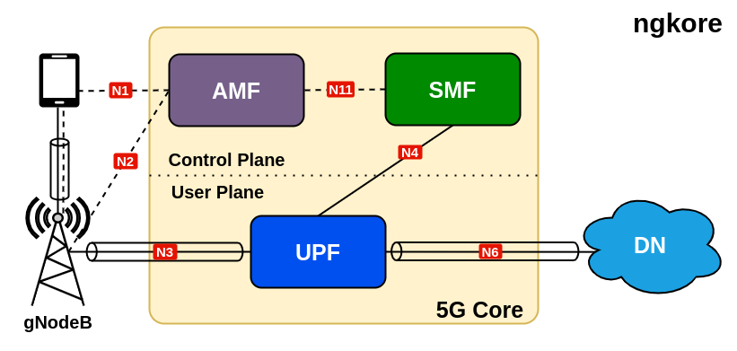
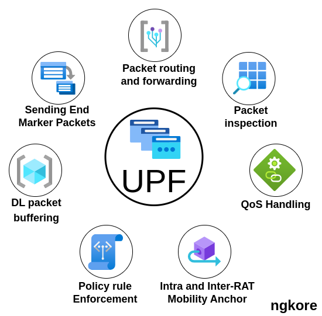
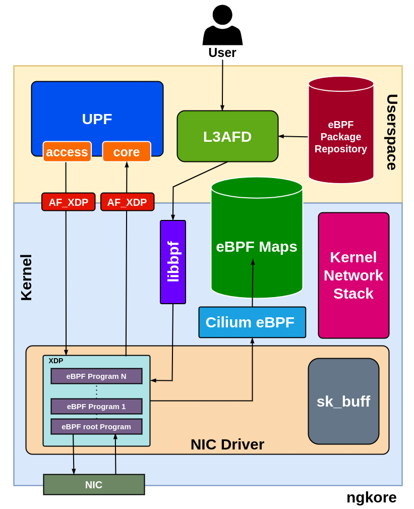

# L3AF Integration with 5G-UPF

**Author:** [Shankar Malik](https://www.linkedin.com/in/evershalik/)

**Published:** June 16, 2023

5G, the fifth generation of wireless technology, promises to revolutionize the way we connect and communicate. One crucial component of the 5G infrastructure is the User Plane Function (_UPF_), responsible for handling data traffic efficiently and ensuring high throughput. As the demand for faster and more reliable connectivity grows, optimizing the performance of the UPF becomes paramount.

Enter L3AF, an orchestrator for eBPF (_extended Berkeley Packet Filter_) programs, developed under the Linux Foundation. L3AF offers a powerful solution to enhance the efficiency and throughput of the UPF in 5G networks. By integrating L3AF with the 5G-UPF, we can unlock a new level of performance and unleash the true potential of 5G.

In this blog post, we will delve into the exciting world of L3AF integration with 5G-UPF and explore how it can revolutionize the way we experience 5G connectivity. We will discuss the implementation aspects of this integration, shedding light on the incredible possibilities it offers for increasing efficiency and throughput in the UPF. So, let's dive in and discover the transformative power of L3AF in the 5G ecosystem.

## L3AF Architecture

1.  **User API Call**: The process starts when a user sends an API call containing configuration data for the deployment of eBPF programs on the kernel, specifically at XDP and TC hooks.
2.  **Policy Formation**: The configuration data from the API call is transformed into specific policies, which are then stored in a database for future use.
3.  **Data Retrieval by L3AFD**: L3AFD, leveraging a key-value (_KV_) store, quickly retrieves the stored configuration data from the database.
4.  **eBPF Program Download**: L3AFD downloads pre-built eBPF programs from a user-configured repository (_eBPF Package Repository_). These programs are provided by a diverse community of developers and are verified prior to installation in the eBPF store.
5.  **L3AFD Role**: As the main component of the L3AF control plane, L3AFD manages and orchestrates multiple eBPF programs.
6.  **eBPF Program Loading**: The L3AFD loads these eBPF programs into the kernel using the libbpf library. The file descriptors of the programs are stored in a previous eBPF map, keeping track of the sequence of programs that need to run in the process. The process of creating a separate space in the eBPF Maps and storing the File descriptor into it, is carried out by using Cilium eBPF library.
7.  **Program Execution**: Only the first eBPF program in this sequence is visible to the NIC. The rest are invoked in sequence via a bpf_tail_call, which uses the stored file descriptors in the current program's map.
8.  **Packet Processing**: Each packet is sequentially processed through each eBPF program and then passed on to the network stack for further processing. Similar processing occurs at the TC hook of the network stack.
9.  **Packet Delivery**: Finally, the processed packet is sent to the destination application for any further necessary processing.

## 5G UPF

The UPF (_User Plane Function_) plays a vital role in the data plane of 5G core network. Its primary responsibility is to perform packet
forwarding and enforce forwarding policies for user data traffic. Essentially, it ensures that data packets are delivered to their desired
destinations based on the network policies and QoS (_Quality of Service_) requirements defined by the service provider.

One of the key functionalities of the UPF is to handle traffic management which includes packet inspection, filtering, and even DPI (_Deep Packet Inspection_). These capabilities allow the UPF to analyze the contents of data packets, making decisions based on specific criteria defined by the network policies.

Moreover, the UPF serves as a critical component in enabling advanced 5G features, such as network slicing.

## L3AF Integration with 5G UPF

1.  **Packet Arrival**: Network packets first arrive at the NIC, which serves as the primary interface for incoming data from the network.
2.  **Processing at XDP Hook**: The packets are initially processed at the XDP hook, a specific point in the Linux kernel designed for fast processing of network packets. Here, eBPF programs, managed and loaded by L3AFD, perform the first level of packet processing. These programs offer highly flexible and efficient packet filtering and manipulation capabilities.
3.  **Kernel Bypass via AF_XDP**: After the initial processing, the packets are then sent directly to the UPF, bypassing the traditional kernel network stack. This is facilitated by the AF_XDP socket, a mechanism designed to increase performance of packet processing by avoiding overhead associated with the kernel.
4.  **UPF Processing**: The UPF then conducts further processing on these packets. UPF is a critical part of the 5G network architecture, responsible for handling user data traffic and interconnecting the various parts of the network.
5.  **Packet Dispatch**: After processing at the UPF, the packets are then dispatched to their respective destinations.
6.  **Role of L3AF**: Throughout this entire process, the L3AF framework plays a critical role. It manages and orchestrates the execution of eBPF programs that govern the entire packet processing procedure. Its role in loading these programs at the XDP hook and ensuring their effective function forms the basis of this optimized processing path.
7.  **Network Optimization**: This packet processing pathway, facilitated by L3AF and AF_XDP, results in a more efficient and high-performing network system. It minimizes latency, reduces the overhead typically associated with kernel involvement, and allows for more direct and faster processing of network packets.

By leveraging these advanced technologies, we can significantly enhance network performance and the overall user experience.

