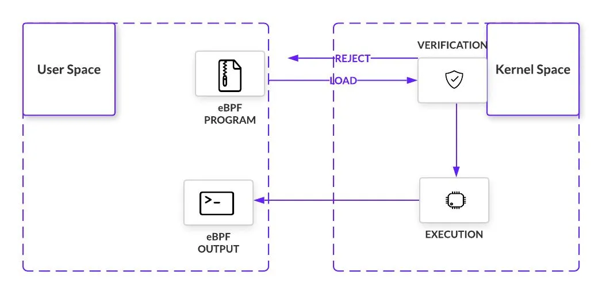
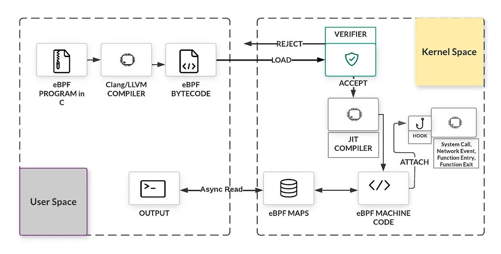

# Understanding eBPF in the Linux Kernel

**Author:** [Khushi Chhillar](https://www.linkedin.com/in/kcl17/)

**Published:** June 20, 2023

eBPF (Extended Berkeley Packet Filter) is a kernel-level framework that enables safe execution of user-defined programs within the Linux kernel space. This technology provides a sandboxed virtual machine environment for running custom code with minimal overhead, fundamentally transforming how applications can interact with and observe kernel operations.

## What is eBPF?

eBPF (Extended Berkeley Packet Filter) is a framework that allows users to execute custom code within the kernel in a secure, sandboxed environment. The system functions as a lightweight virtual machine within the Linux kernel, enabling programmers to run Berkeley Packet Filter (BPF) bytecode while maintaining access to specific kernel resources.

## Key Features of eBPF

1. **Safe and Sandboxed Execution Environment**: Provides secure execution context with verification mechanisms
2. **Low Overhead and High Performance**: Optimized execution with minimal impact on system performance
3. **Dynamic Code Injection and Tracing Capabilities**: Enables runtime program loading and system observation
4. **Efficient Data Collection and Analysis**: Supports in-kernel data aggregation and processing
5. **Cross-Platform Support**: Available across multiple operating systems and architectures

## How eBPF Works

eBPF operates through a sophisticated architecture combining bytecode execution, JIT (Just-In-Time) compilation, and kernel hooks to provide a comprehensive framework for dynamic code execution and system introspection.

### eBPF Programs

eBPF programs are small, specialized code segments written in a restricted domain-specific language. These programs target specific tasks including packet filtering, system call interception, and data analysis. Programs are compiled into bytecode—a low-level representation executable by the eBPF virtual machine.

The BCC (BPF Compiler Collection) framework demonstrates this process by enabling eBPF code development in C. BCC compiles the code to eBPF bytecode using Clang/LLVM and loads it into the kernel via the bpf() system call.

### eBPF Verifier

The eBPF verifier performs comprehensive safety analysis after programs enter the kernel through the bpf() system call. The verifier traverses all potential execution paths to ensure program termination without infinite loops that could cause kernel lockup. Additional verification includes register state validation, program size limits, and bounds checking for jumps.

### JIT Compilation

Following successful verification, eBPF bytecode undergoes just-in-time (JIT) compilation to native machine code. eBPF's modern architecture features 64-bit encoding with 11 registers, providing efficient mapping to hardware architectures including x86_64, ARM, and arm64. Runtime compilation enables high performance despite the intermediate virtual machine layer.

### Kernel Hooks

Compiled eBPF programs attach to hooks within the Linux kernel. These hooks represent specific entry points in the kernel's execution flow, enabling eBPF programs to intercept and modify kernel or subsystem behavior at precise execution points.

### eBPF Maps

eBPF utilizes maps for data storage and sharing between programs and kernel or user space. Maps implement key-value data structures supporting various formats including hash tables, arrays, and tries. Programs interact with maps through helper functions for data exchange operations.

## eBPF Use Cases

### Security

eBPF enhances security capabilities by providing comprehensive visibility into system calls and network operations. Traditional security systems typically handle system call filtering, process context tracing, and network-level filtering as separate, independent systems. eBPF enables unified control and visibility across all security aspects, allowing development of context-aware security systems with enhanced control mechanisms.

### Observability

eBPF enables dynamic visibility event generation and custom metric collection with in-kernel aggregation from diverse sources. This approach surpasses traditional reliance on static counters and operating system gauges. The technology increases visibility depth while dramatically reducing system overhead by collecting only necessary data and producing histograms and data structures at event sources rather than exporting raw samples.

### Networking

eBPF's combination of efficiency and programmability makes it suitable for comprehensive networking packet processing requirements. The programmable architecture enables additional protocol parser integration and flexible forwarding logic implementation to address evolving requirements without leaving the Linux kernel's packet processing context. JIT compilation provides execution performance approaching natively compiled in-kernel code.

### Tracing and Profiling

eBPF programs can attach to trace points, kernel probes, and user application probe points, enabling runtime behavior visibility for both applications and systems. The combined introspection capabilities provide unique insights for troubleshooting system performance issues. Advanced statistical data structures enable efficient visibility data extraction without requiring large-scale sampling data export typical of conventional systems.

## Conclusion

eBPF represents a significant advancement in kernel programming technology with transformative potential for computing systems. The capability to dynamically inject and execute verified code within the kernel enables new approaches to system security, observability, networking, and performance analysis across diverse application domains.
