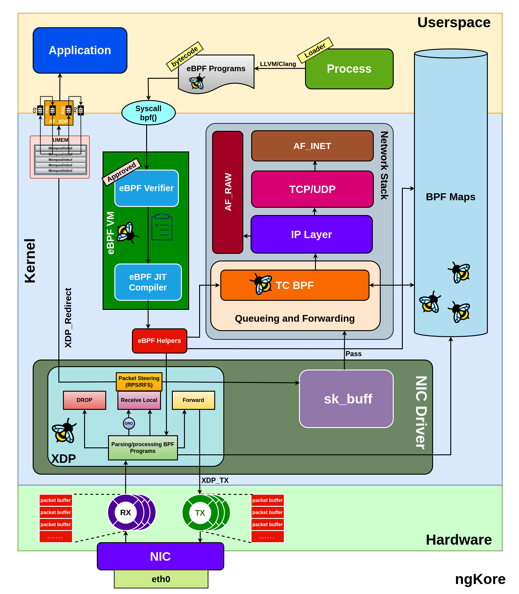
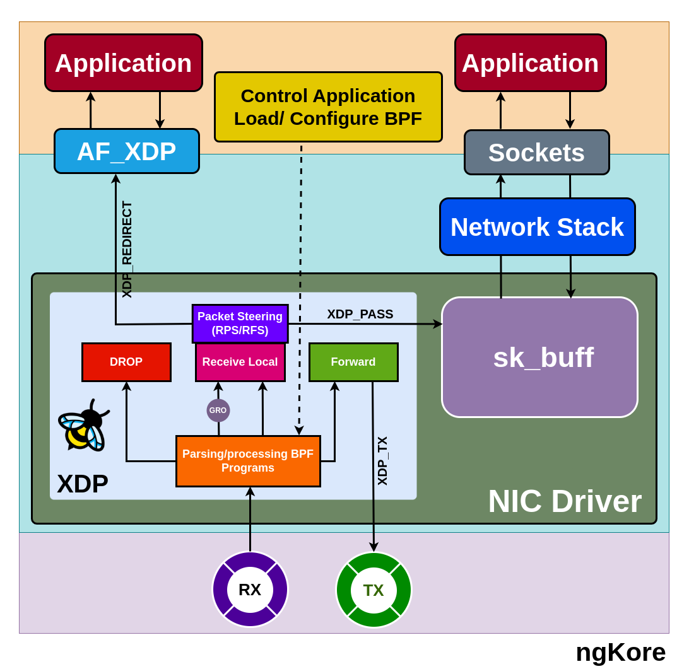
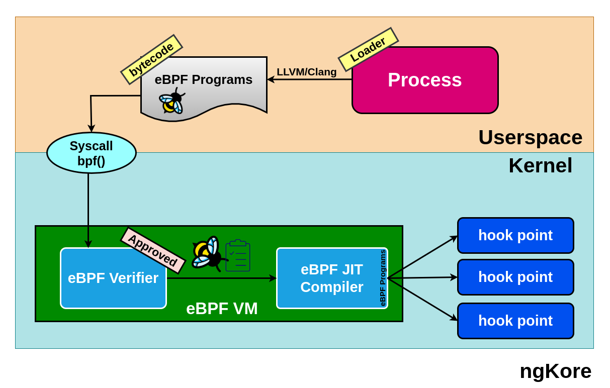
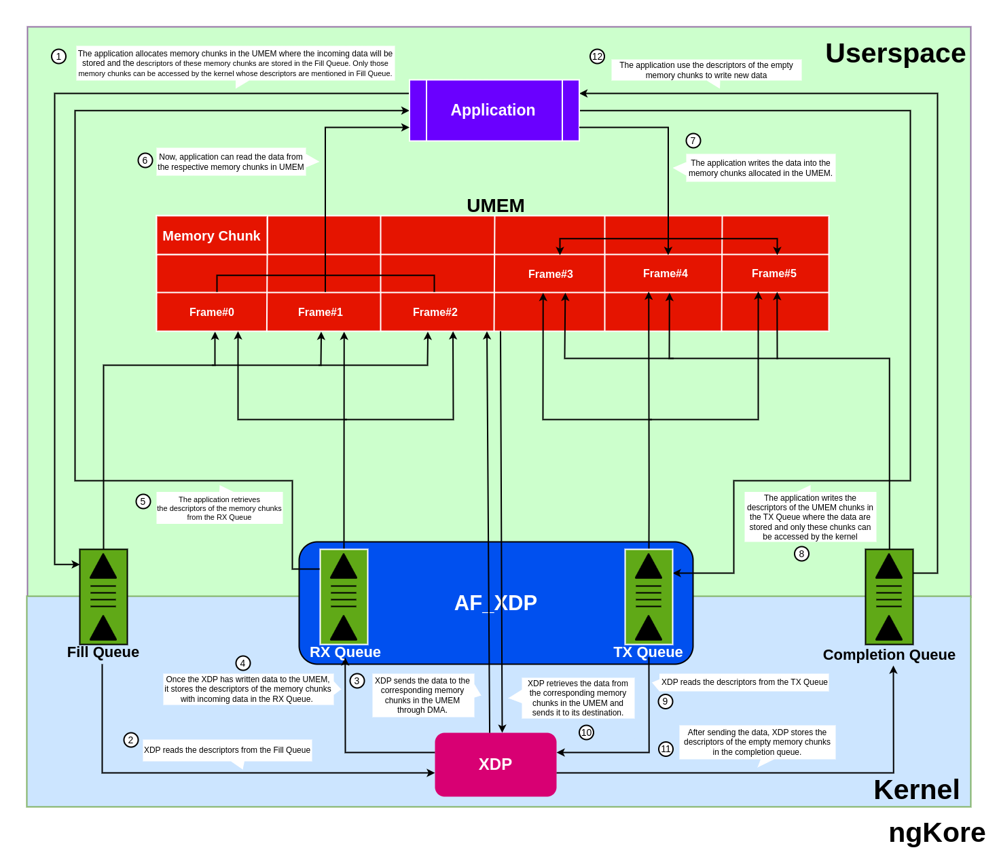

# AF_XDP

**Author:** [Shubham Kumar](https://www.linkedin.com/in/chmodshubham/)

**Published:** May 30, 2023

AF_XDP(*Address Family - eXpress Data Path*) socket is a
high-performance mechanism for bypassing the traditional kernel network
stack, enabling userspace applications to process packets directly. It
uses eBPF programs at the XDP hook and shared userspace memory(*UMEM*)
to efficiently transfer packets between the NIC and userspace, reducing
latency and improving throughput for packet processing tasks.

## Hardware Requirements

To implement XDP and AF_XDP effectively, certain hardware-level features
and capabilities should be present in your system:

1.  **NIC compatibility** - Ensure the NIC supports the XDP and AF_XDP
    features.
2.  **Driver support** - XDP support depends on the network driver.
    Currently, it is supported by Broadcom\'s bnxt, Cavium\'s thunderx,
    Intel\'s ixgbe, ixgbevf, and i40e, Mellanox\'s mlx4 and mlx5,
    Netronome\'s nfp, and Qlogic\'s qede drivers.
3.  **Hardware queue support** - XDP requires the NIC to support
    multiple hardware queues. The number of queues required depends on
    the number of CPU cores available for packet processing.

## Components of XDP System

The Major components of the XDP system are:

1.  **XDP Driver hook** - It is the main entry point where the eBPF
    programs are implemented at the network driver level. The main focus
    is to execute the XDP program at the earliest possible time after a
    packet is received from the NIC hardware.

    

2.  **eBPF VM** - It is a lightweight, register-based VM responsible for
    executing the bytecode of the XDP program. The eBPF VM also performs
    JIT(*Just-In-Time*) compilation to increase performance by
    converting the bytecode to native machine code for the specific CPU
    architecture.

    

3.  **BPF Maps** - These are key-value stores that serve as the primary
    communication channel between the eBPF programs running at different
    locations in the kernel and also between the kernel and the
    userspace applications. BPF maps can be used for various purposes,
    such as storing configuration data, packet statistics, connection
    tracking, and flow state information.
4.  **eBPF Verifier** - The eBPF verifier is a critical component that
    statically verifies eBPF programs before they are loaded into the
    kernel and checks whether the program bytecode is safe or not. It
    checks the program for safety and correctness, ensuring that it
    doesn\'t have any loops, doesn\'t access out-of-bounds memory, and
    adheres to other safety constraints.
5.  **eBPF Loader** - The eBPF loader is a user-space tool, such as
    \'iproute2\', that loads the eBPF program into the kernel.

## Packet Flow

### From NIC to the Application

1.  Packets arriving at the NIC are temporarily stored in its internal
    memory(*implemented using SRAM, or dedicated DRAM*).
2.  NIC performs normal packet processing (*e.g., error checking, basic
    filtering*), creates packet descriptors (*packet size + buffer
    address*), and places them in the RX ring buffer.
3.  The packet descriptors are passed onto the XDP hook of the NIC
    driver, where the eBPF program processes the packets fetched from
    the NIC internal memory and takes decisions based on the eBPF
    program. It decides whether to pass the packet to an AF_XDP socket
    or continue through the kernel network stack
4.  If the eBPF program decides to pass the packet to an AF_XDP socket,
    the packet data is DMA-mapped from the NIC\'s internal memory into a
    region of user memory (*UMEM*), shared between the kernel and user
    space.
5.  First, XDP reads the descriptors of the empty memory chunks in the
    UMEM region from the Fill Queue then DMA-mapped the data packets
    from the NIC\'s internal memory to the provided memory chunks and
    then stores the filled memory chunks' descriptors into the RX queue.
6.  The application retrieves the descriptors of the memory chunks from
    the RX Queue and processes the packets.

### From Application to the NIC

1.  The application prepares packets for transmission, storing them in
    designated memory chunks within the UMEM (*Userspace MEMory*)
    region, and places their corresponding descriptors in the TX
    (*transmit*) queue associated with the AF_XDP socket.
2.  XDP retrieves the descriptors from the TX queue and transfers the
    data packets from the respective memory chunks to the NIC\'s
    internal memory using DMA (*Direct Memory Access*).
3.  Subsequently, the descriptors for the now-empty memory chunks are
    added to the UMEM\'s Completion queue.
4.  Upon possessing the packet descriptors, XDP determines the
    appropriate destination for the packets. It forwards the descriptors
    to the NIC\'s TX ring, from which the packets are transmitted to
    their intended destinations.
