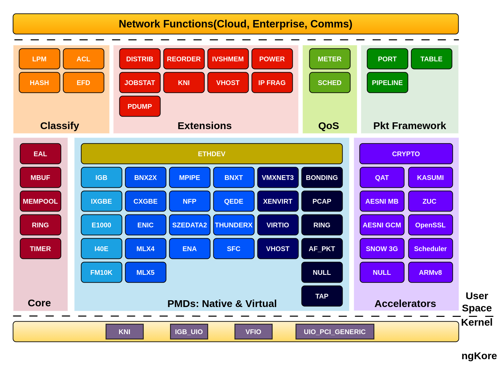
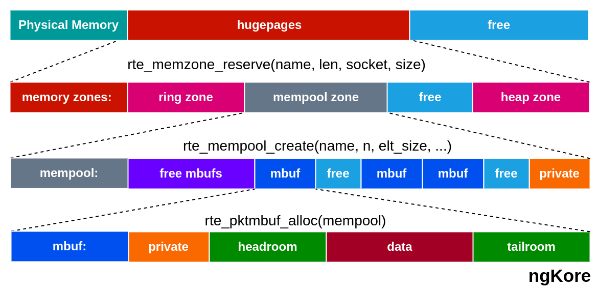
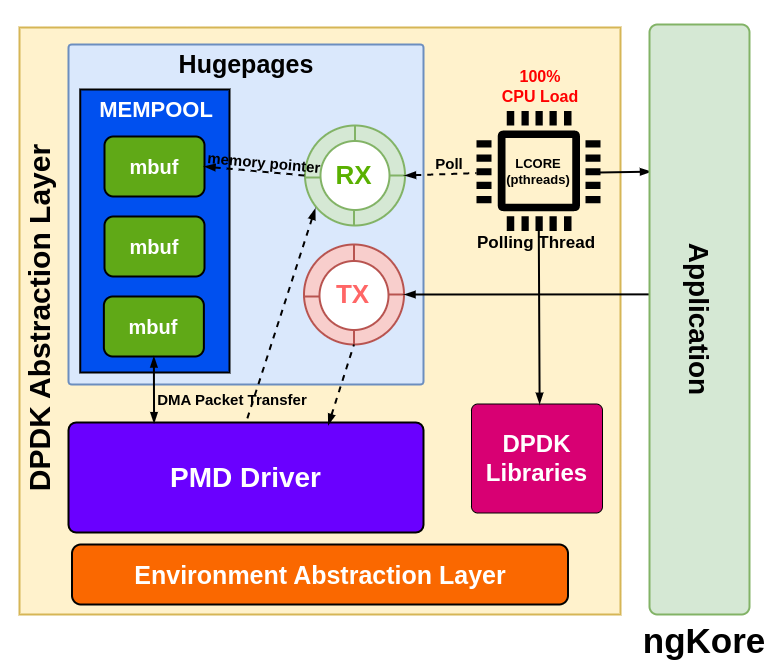
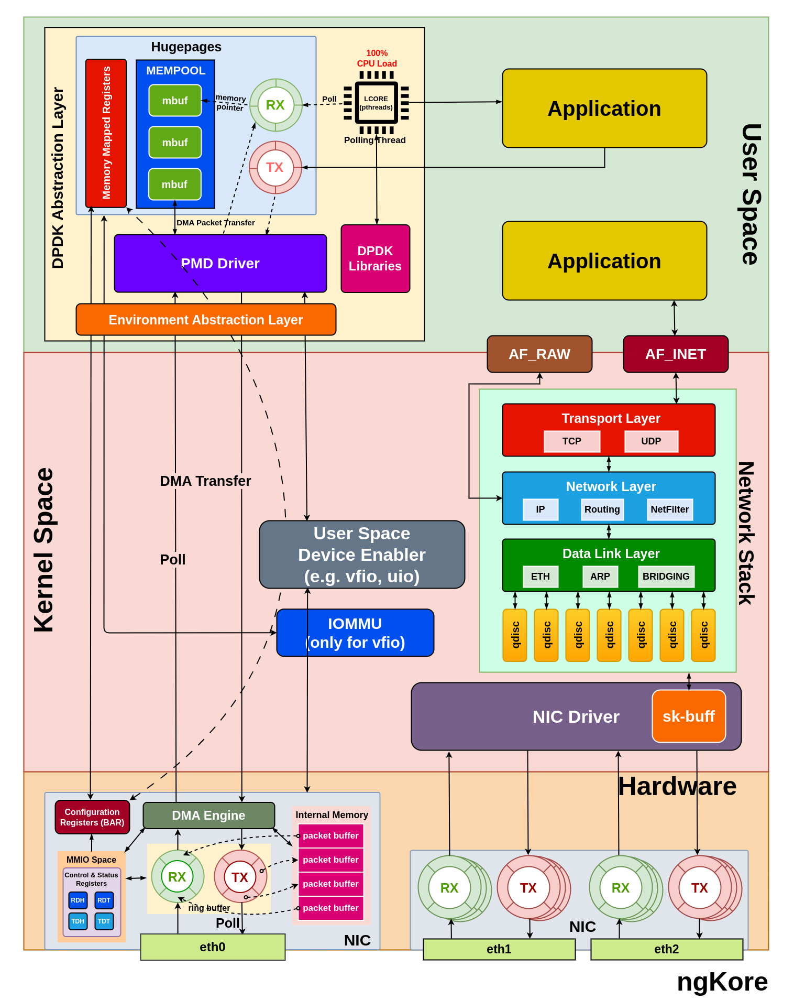
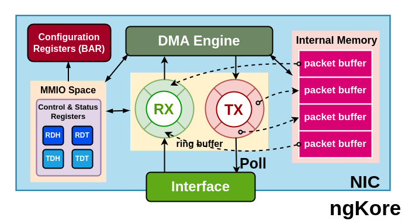
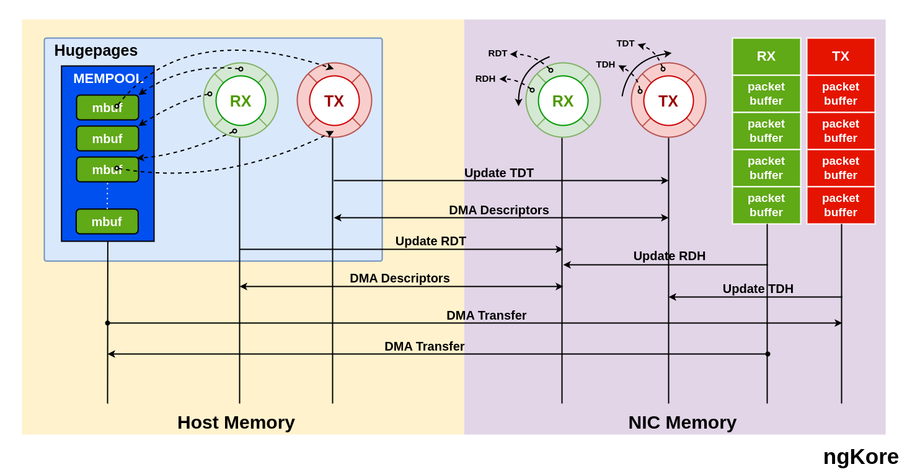
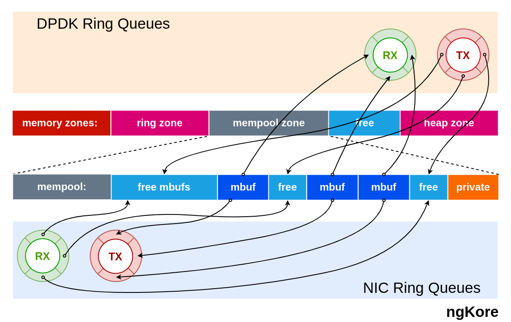

# DPDK

**Author:** [Shubham Kumar](https://www.linkedin.com/in/chmodshubham/)

**Published:** May 22, 2023

DPDK(*Data Plane Development Kit*) is a toolkit or a set of libraries
and PMD drivers that help us to attend the high-performance packet
processing at the application level by bypassing the traditional kernel
network stack and directly interacting with the NIC hardware using the
userspace driver, which helps achieve low latency and high throughput
performance.

However, in scenarios where specific packets need network stack
processing, it is crucial to implement a user space network stack to
handle those requirements efficiently.

## Hardware Requirements

To implement DPDK, there are several hardware-level requirements and
configurations necessary to ensure the proper functioning and
high-performance packet processing. These are:

1.  **Compatible NIC(Network Interface Card)** - DPDK requires a
    [\[compatible NIC\]](https://core.dpdk.org/supported/#nics) that
    supports the required features for efficient packet processing.
2.  **Detaching NIC from the kernel driver** - Before using a NIC with
    DPDK, the NIC must be detached from the associated kernel network
    driver. This is necessary to allow the DPDK userspace application to
    have direct control over the NIC without interference from the
    kernel.
3.  **Attaching NIC to the appropriate DPDK driver** - After detaching
    the NIC from the kernel driver, the NIC needs to be bound with the
    appropriate DPDK-compatible driver, such as vfio-pci, igb_uio, or
    uio_pci_generic. These drivers enable direct access to the NIC from
    the DPDK userspace application and reduce the overheads associated
    with context switching, interrupt handling, and memory management.
4.  **CPU and NUMA(Non-Uniform Memory Access) considerations** - To
    avoid contention with other system processes, it is best practice to
    assign dedicated CPU cores to the DPDK application. This can be
    achieved using CPU pinning or isolation. Also, the memory allocated
    for the DPDK application should be from the same NUMA node where the
    CPU cores and NICs are located, this will minimize the latency and
    maximize the performance.
5.  **Hugepages** - A portion of memory should be reserved as hugepages
    during boot for DPDK to use for memory allocation. This helps to use
    larger page sizes, reducing the overheads associated with managing
    memory using smaller page sizes. Using a large continuous memory
    area with hugepages, it also reduces data fragmentation and other
    memory management operations such as TLB, lookups, etc.

    

6. **IOMMU(Input-Output Memory Management Unit) support** - For systems 
    that use VFIO-PCI drivers, IOMMU support in the BIOS and kernel is
    needed. IOMMU provides memory isolation and protection for devices,
    allowing secure direct access to the NIC hardware from the userspace
    application. IOMMU provides a short path for devices to get access only
    to a well-scoped physical device memory area that corresponds to a DPDK
    application.

## Components of DPDK Abstraction Layer

In addition to the PMD driver, DPDK comprises essential libraries that
enable high-performance packet processing. Most importantly, the core
library provides abstractions for efficient packet handling. Key
components include the Environment Abstraction Layer (*EAL*), Memory
Buffer (*MBUF*), Ring Buffer (*RING*), Memory Pool (*MEMPOOL*), and
Timer libraries.

1.  **EAL** - The EAL is responsible for setting up the runtime
    environment for the DPDK application, and providing a generic
    interface between the DPDK application and the underlying OS for
    accessing hardware and memory resources.
2.  **MBUF** - It manages memory buffers for packet data and associated
    metadata. MBUFs are allocated from DPDK memory pools and used to
    store packet data throughout the processing pipeline.
3.  **RING** - RING is used for implementing receive (*RX*) and transmit
    (*TX*) ring buffers, which are crucial for managing packet
    descriptors and ensuring smooth packet flow between the NIC and the
    DPDK application.
4.  **MEMPOOL** - This is the pre-allocated, fixed-size memory pool
    region inside the hugepages. It is used for allocating MBUFs and
    other objects that require consistent and fast memory access.

## Packet Flow

### From NIC to the Application

1.  Packets arriving at the NIC are temporarily stored in its internal
    memory(*implemented using SRAM, or dedicated DRAM*).
2.  NIC processes the packet(*e.g., error checking, basic filtering*),
    creates packet descriptors(*packet size + buffer address*), and
    placed them in the RX ring buffer.
3.  The RX ring is managed by the PMD(*Poll Mode Driver*) driver using 2
    registers i.e. Receive Descriptor Head (*RDH*) and Receive
    Descriptor Tail (*RDT*) registers. These registers are control and
    status registers stored in MMIO space(*memory-mapped I/O*).
4.  NIC uses DMA(*Direct Memory Access*) engines to transfer packet data
    directly from its internal storage to a pre-allocated mbuf(*memory
    buffer*) in the host memory.

    

5.  The NIC\'s MMIO space, which includes control and status registers,
    is mapped into the host memory address space(*mempool*) using the
    BAR(*Base Address Register*). The PMD driver can access these
    registers to control and configure the NIC.
6.  Initially, both RDH and RDT register point to the same position in
    the RX ring. Once the packet arrived in the NIC, the packet
    descriptor is stored in the region specified by the RDH register and
    gets incremented for every new packet descriptor added.
7.  The PMD driver, running on a dedicated CPU core, constantly polls
    the RX ring for new descriptors from the position pointed to by the
    RDT register. When a descriptor is found, the DPDK application
    retrieves the associated mbuf and processes the packet data, and
    increments the RDT register by 1 to point to the next packet
    descriptor in the RX ring.
8.  The PMD driver continues to poll and process packet descriptors as
    long as the RDT register points to a different location than the RDH
    register. When the RDT and RDH are equal, it means that the RX ring
    is empty, and the PMD driver has processed all available packet
    descriptors.

    

9.  The PMD driver is used to poll packets directly from the RX ring of
    the physical NIC, without involving the CPU. The PMD driver uses a
    polling mechanism to continuously check the RX ring for incoming
    packets and transfers them to the corresponding RX queue in the DPDK
    NIC abstraction layer using DMA.
10. The PMD driver initializes the descriptor rings and mbuf pools in
    the huge pages and uses them to keep track of the packet. This
    method reduces the overhead associated with the CPU interrupts, but
    can also consume a significant amount of CPU resources. PMD driver
    is also responsible for calling the EAL functions.
11. The pThreads are typically used in multi-core systems, where each
    pThread is pinned to a dedicated CPU core and is responsible for
    polling one or more DPDK NIC queues for incoming packets. The
    pThreads continuously poll the RX queues for new packets and process
    them when they are received.
12. pthreads poll the data packets from the mbuf region of the mempool
    pointed by the packet descriptors in the RX ring of the DPDK
    abstraction layer, process them and send them to the application.

### From Application to the NIC

1.  The application prepares the packet for transmission, storing it in
    a mbuf allocated from the DPDK memory pool, typically configured
    using hugepages.
2.  The PMD driver running on a dedicated CPU core retrieves the packet
    data from the mbuf and creates a descriptor containing metadata such
    as packet size, and buffer address.
3.  The PMD places the descriptor in the TX ring, which is located in
    the mempool.

    

4.  PMD driver places the packet descriptor in the location pointed by
    the TDT(*Transmit Descriptor Register*) register and updates it to
    point to the next descriptor.
5.  The TDT and TDH registers are located in the NIC\'s
    MMIO(*memory-mapped I/O*) space, which is accessible to the PMD
    driver through the BAR(*Base Address Register*).
6.  The NIC continuously polls the TX ring by checking the TDH(*Transmit
    Descriptor Head*) register.
7.  When the NIC detects a new descriptor at the TDH register, it
    retrieves the associated data packet from the mbuf of the host
    memory and updates the TDH register to point to the next location.
8.  The NIC uses DMA(*Direct Memory Access*) engines to transfer packet
    data from the mbuf in the host memory to its internal storage.
9.  The NIC performs any necessary processing tasks, such as adding
    checksums or VLAN tags, before transmitting the packet.
10. Finally, the NIC transmits the packet data through the appropriate
    network interface.
