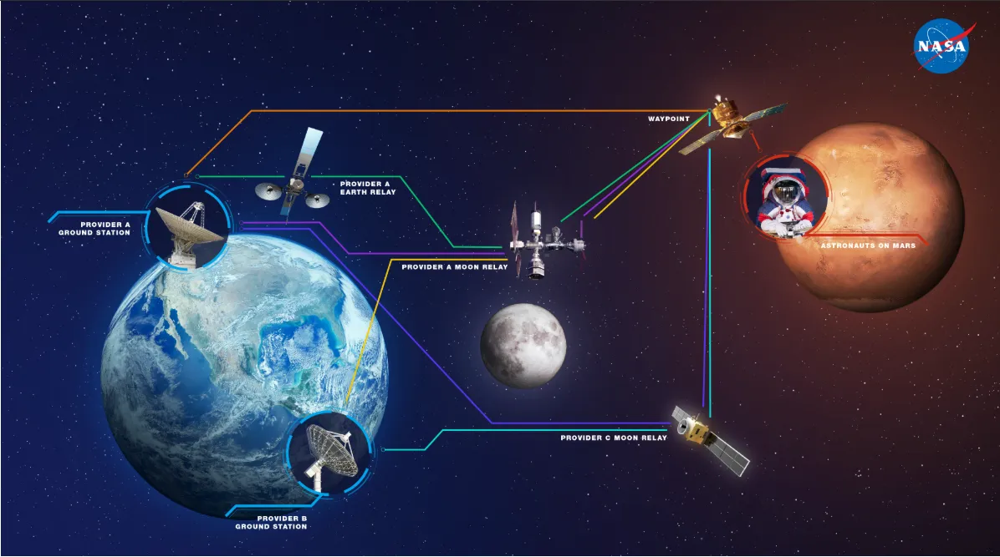

# Delay-Tolerant Networking

**Author:** [Satyam Dubey](https://www.linkedin.com/in/satyam-dubey-142598258/)

**Published:** June 11, 2025

## Introduction

In an era dominated by the demand for real-time and low-latency communications, certain environments fundamentally challenge these expectations. Delay-Tolerant Networks (DTNs), as formalized in RFC 4838, provide a robust solution for networking across environments where persistent connectivity, low delays, or reliable paths are not feasible. DTN architecture has proven instrumental not only in deep-space communication but in terrestrial environments facing frequent link disruptions, such as rural, disaster, or isolated zones.

## Limitations of the Traditional Internet Architecture

The conventional Internet protocol stack is built on several implicit assumptions:

- **A continuous, end-to-end path exists between endpoints.**
- **Timely acknowledgments ensure reliability.**
- **Packet loss is rare and transient.**
- **All nodes support compatible protocol stacks (i.e., TCP/IP).**
- **Applications remain agnostic to underlying network constraints.**
- **Endpoint security is the primary concern.**
- **Stateless packet switching is the transmission model.**
- **Single optimal route selection is sufficient.**

In highly disrupted or long-delay environments, including interplanetary communication, these assumptions do not hold.

## DTN’s Architectural Paradigm

DTN fundamentally alters the approach to networking in challenging environments. Key DTN design principles include:

### 1. Intermittent Connectivity and Store-and-Forward

Unlike the Internet's presumption of a real-time route from sender to receiver, DTN nodes accept, store, and forward data opportunistically, potentially over durations spanning hours or days.

### 2. Deferred and Custodial Reliability

DTN leverages _custody transfer,_ transferring responsibility for delivery to each node in the path, ensuring reliable storage and future forwarding. Unlike TCP's reliance on immediate acknowledgments, DTN circumvents the infeasibility of rapid feedback in high-delay environments.

### 3. Robustness to Persistent Loss

Designing for environments where communication loss and disruptions are routine, DTN implements mechanisms to assure message delivery even under prolonged disconnects or node outages.

### 4. Protocol and Naming Flexibility

DTN introduces protocol-agnostic _endpoint identifiers (EIDs),_ decoupling naming and delivery from the constraints of existing IP addressing schemes. This enables interoperability across heterogeneous networks and supports scenarios where nodes may not always participate in TCP/IP or remain continuously addressable.

### 5. Explicit Application Awareness

Applications operating over DTN can specify parameters such as data lifetimes and acceptable delays, adapting to the realities of sparse and intermittent contact opportunities. This explicit interaction between application requirements and network operation is central to DTN’s adaptability.

### 6. In-Network Security Model

Given that data is persistently stored across multiple, potentially untrusted relays, DTN enforces integrity checks, authentication, and rapid discarding of invalid or compromised bundles at each hop, supplementing the traditional endpoint security model.

### 7. Message Switching and Persistent Storage

DTN employs message-based switching (the Bundle Protocol) rather than stateless packet routing. Each bundle is stored persistently at intermediate nodes until a suitable transmission opportunity arises.

### 8. Multipath and Opportunistic Routing

DTN supports dynamic route selection over multiple potential paths, leveraging time-varying, opportunistic contacts to maximize delivery success in unpredictable network topologies.

[Watch Delay/Disruption Tolerant Networking from NASA](https://youtu.be/0gCMIiJdYPQ)

## The Bundle Protocol

At the core of DTN is the Bundle Protocol (BP), implemented as a store-and-forward overlay. This protocol sits above the transport (or directly above lower network layers) and manages end-to-end message reliability and custody transfers, regardless of underlying network disruptions.   

**Essential Components**

- **Bundle Agents:** Nodes responsible for processing, storing, and forwarding message bundles, analogous to logistical hubs in space or disrupted networks.
- **Custody Transfer:** Explicit delegation of delivery responsibility at each hop, enabling robust delivery in the absence of a real-time path.
- **Contact Graph Routing (CGR):** Routing decisions are made using a time-evolving contact plan, supporting scheduled or predicted network dynamics.
- **Endpoint Identifiers (EIDs):** Abstract, URI-based identifiers allowing flexible addressing decoupled from immediate network presence.

**Operational Workflow**

1. **Discovery:** Nodes determine future or potential communication contacts using orbit predictions, schedules, or mobility patterns.
2. **Negotiation:** Nodes may establish contact parameters (timing, bandwidth, duration) to optimize use of limited communication windows.
3. **Transmission:** Bundles are transmitted during contact opportunities, whether scheduled or opportunistic.
4. **Custody Acknowledgment:** Upon accepting custody, the receiving node notifies the previous custodian, updating delivery responsibility.

## Bundle Processing Lifecycle

1. **Queuing and Scheduling:** Bundles are queued and prioritized based on parameters such as class of service, lifetime, and delivery constraints.
2. **Fragmentation:** Large bundles are fragmented as necessary to accommodate short or low-bandwidth contacts.
3. **Security and Authentication:** Security measures, including signature and encryption, are applied at each hop due to the absence of continuous end-to-end paths.
4. **Opportunistic Routing:** Bundles may be dynamically rerouted if superior contact opportunities present themselves.
5. **Cleanup:** Bundles are removed from persistent storage upon successful transmission and custody acknowledgment, optimizing local resources.

## Conclusion

Delay-Tolerant Networking represents a comprehensive rethinking of network protocol architecture to support resilient, reliable communication in unpredictable and high-delay environments where traditional Internet approaches are insufficient. By redefining fundamental assumptions, introducing opportunistic and persistent forwarding, and enforcing holistic security, DTN enables robust networking across domains as disparate as deep space, disaster relief, and remote terrestrial locations.

> _Note: For foundational technical specifications and further technical information on DTN and the Bundle Protocol, refer to RFC 4838 (Delay-Tolerant Networking Architecture) and RFC 5050 (Bundle Protocol Specification)._
