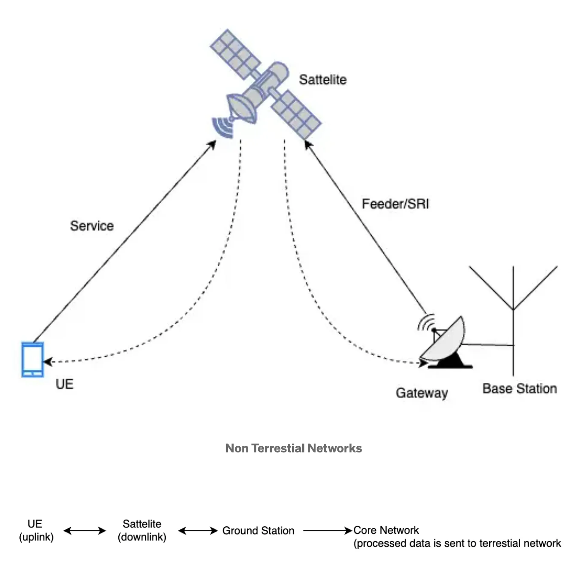

# Introduction to NTN

**Author:** [Megha](https://www.linkedin.com/in/megha-7aa3a0203/)

**Published:** May 4, 2025

> _Part 1 of 2: OpenAirInterface (OAI) NTN Series_

As 5G evolves, Non-Terrestrial Networks (NTN) are emerging as a key enabler for global, seamless connectivity — especially in regions beyond the reach of ground-based infrastructure. NTN brings the sky into the 5G equation, using satellite systems and high-altitude platforms to deliver coverage where traditional cell towers cannot reach.

These systems are crucial for:

- Connecting remote or rural areas
- Enabling communication in disaster zones
- Supporting mobile connectivity in aviation, maritime, and defense scenarios

## Types of Satellites in NTN

1. **GEO (Geostationary Earth Orbit):** Approximately 35,786 km above Earth, these satellites rotate in sync with the planet. They remain fixed in the sky relative to a location on the ground and offer continuous coverage to large regions but introduce high latency (~500 ms round-trip).
2. **MEO (Medium Earth Orbit):** Orbiting between ~8,000 km and 20,000 km, MEO satellites provide a compromise between coverage and latency. They are commonly used in systems like GPS.
3. **LEO (Low Earth Orbit):** Operating at ~500–2000 km altitude, LEO satellites offer low latency (~20–40 ms), making them ideal for real-time applications. Due to rapid movement across the sky, continuous coverage requires a large constellation (e.g., Starlink, OneWeb).
4. **HAPS (High-Altitude Platform Systems):** While not satellites, HAPS function in the stratosphere (~20 km) using platforms like balloons or drones to provide localized NTN coverage, valuable for disaster relief or targeted rural deployment.

Unlike terrestrial networks, NTN introduces a series of technical challenges:

- **Long signal propagation delays** (particularly for distant satellites like GEO)
- **Doppler shifts** caused by fast-moving satellites (notably in LEO)
- **Timing and synchronization** issues arising from variable satellite movement and distance

## Fundamental Terminologies related to NTN

1. **User Equipment (UE):** The end-device in the network — such as a smartphone, IoT sensor, modem, or any equipment connecting to 5G. In NTN, the UE needs to handle higher delays, Doppler shifts, and potentially beam-switching events.
2. **gNB (Next Generation NodeB):** The 5G base station. In NTN, the gNB could be situated on the ground (connecting via satellite link) or form part of a regenerative payload on the satellite itself. It is responsible for radio access layer operations like scheduling, HARQ management, and RLC/MAC control.
3. **NTN Payloads:**
   - **Transparent Payload (Bent-Pipe Payload or RF Repeater):** Acts as a simple relay, forwarding RF signals between ground stations without onboard processing. All protocol management occurs at the ground gNB. Transparent payloads are cost-effective and typical in current LEO systems.
   - **Regenerative Payload (Non-Transparent Payload or Onboard Processing (OBP) Payload):** Contains onboard processing capabilities. The satellite demodulates, decodes, and processes signals internally, then remodulates and transmits to users. This mitigates latency, facilitates routing in orbit, and enables autonomous operation if feeder links are down.
4. **Feeder Link:** The backhaul connection between the satellite and the ground gNB or gateway, acting as the bridge to the core network.
5. **Service Link:** The access connection between the satellite and the UE, responsible for carrying user data, signaling, and control information.
6. **Propagation Delay:** The increased time required for signals to traverse the significant distances in satellite communication, impacting HARQ, scheduling, and synchronization procedures.
7. **HARQ (Hybrid Automatic Repeat reQuest):** Enhances data reliability by allowing selective retransmission of erroneous data blocks. For NTN, especially with high delays like in GEO, HARQ becomes challenged, leading to timer adjustments or disabling for certain links.
8. **Doppler Shift:** The frequency change induced by relative movement between satellite and UE, significant in LEO orbits and requiring compensation to maintain link integrity.
9. **Beam Handover:** In constellations such as LEO, UEs transition between satellite beams. Beam handover ensures uninterrupted service as satellites move and shift coverage.
10. **Round Trip Time (RTT):** The cumulative time taken by a signal to travel UE → satellite → gNB and back, influencing RACH, HARQ, buffer, and scheduler tuning.
11. **cellSpecificKoffset:** Used for timing offset in Random Access (RACH) procedures, compensating for NTN-induced delays and maintaining gNB/UE synchronization.
12. **Inter-Satellite Links (ISL):** Direct links between satellites, allowing flexible routing and reducing dependency on ground infrastructure.

## Key Differences Between NTN and Terrestrial 5G

- **Propagation Delay:** Terrestrial 5G exhibits ~1–5 ms delay, while NTN (especially with GEO) can exceed 400 ms.
- **Doppler Shift:** Insignificant in terrestrial deployments; highly pronounced in LEO NTN due to orbital motion.
- **Mobility:** Terrestrial networks manage handover between local cells, whereas NTN requires track beam management and satellite handover.
- **Infrastructure:** Terrestrial 5G relies on ground towers and fiber; NTN depends on satellites, feeder links, and gateways.
- **Stability:** Terrestrial links are typically stable; NTN links are subject to change from atmospheric conditions and satellite dynamics.
