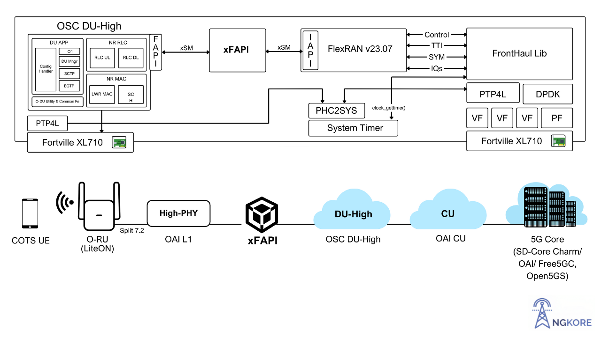

# Open RAN (O-RAN) Interoperability with xFAPI

**Author:** [Vipin Rathi](https://in.linkedin.com/in/vipratos) & [Shubham Kumar](https://www.linkedin.com/in/chmodshubham/)

**Published:** March 27, 2025

> _Part 3 of 3: xFAPI Series_

Achieving interoperability within Open RAN (O-RAN) frameworks requires robust integration between Layer 1 (L1) and Layer 2 (L2) components. xFAPI serves as an essential intermediate component, bridging these layers effectively and ensuring seamless communication across diverse deployment scenarios.

For deeper insights, refer to our previous blogs:

1. Challenges in L1-L2 Interoperability within O-RAN
2. Understanding xFAPI: Bridging L1 and L2 Layers of O-RAN

## Current Interoperability Testing with xFAPI

xFAPI has undergone comprehensive end-to-end interoperability testing across two key topologies:

### Topology 1: FlexRAN Integration

xFAPI has successfully demonstrated interoperability by establishing end-to-end connectivity between OSC DU-High and FlexRAN (versions v22.11 and v23.07).

 

**Deployment Stack:**
Any 3GPP-Compliant 5G Core + CU + OSC DU-High + xFAPI + FlexRAN v22.11/v23.07 + LiteON +COTS UE

 

**Scenario 1**: Single Server Deployment

In this scenario, FlexRAN, xFAPI, and OSC DU-High operate on the same server. xFAPI effectively facilitates communication using the xSM interface on both L1 and L2 sides.

 

**Scenario 2:** Disaggregated L1-L2 Deployment

In this scenario, FlexRAN and xFAPI are deployed on one server, with OSC DU-High running independently on another. Here, xFAPI uses the xSM interface at the L1 side and the nFAPI interface at the L2 side to enable effective communication.

 

### Topology 2: OpenAirInterface (OAI) Integration

To further broaden its interoperability, xFAPI is undergoing modifications to support the nFAPI interface at the L1 side, thus facilitating successful connectivity between OSC DU-High and OAI L1.

 

**Deployment Stack:**
Any 3GPP-Compliant 5G Core + OAI CU + OSC DU-High + xFAPI + OAI L1 + LiteON + COTS UE

 

**Scenario 1:** Single Server Deployment

Here, OAI L1, xFAPI, and OSC DU-High are hosted together on a single server. xFAPI ensures connectivity by employing the nFAPI interface on the L1 side and the xSM interface on the L2 side.

 

**Scenario 2:** Disaggregated L1-L2 Deployment

In this configuration, OAI L1 runs separately on one server, while xFAPI and OSC DU-High are hosted on another. xFAPI implements the nFAPI interface at the L1 side and the xSM interface at the L2 side to facilitate seamless interoperability.

## Building a Multi-Vendor Interoperable Ecosystem

These tested topologies highlight xFAPI’s capacity to build an interoperable environment, significantly enhancing collaboration opportunities for diverse L1-L2 vendors within the O-RAN ecosystem.

 

Stay tuned for our upcoming blog, where we will explore how xFAPI’s evolving capabilities could extend further support to additional L1-L2 vendors and open-source stacks, promoting an even more resilient interoperable ecosystem.
