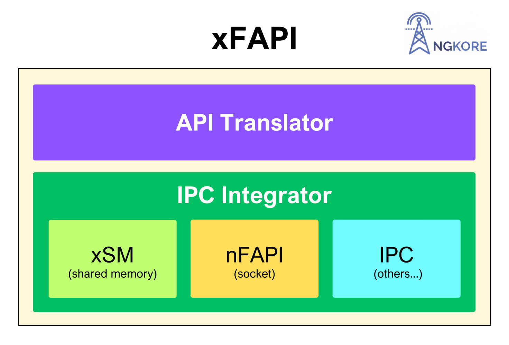
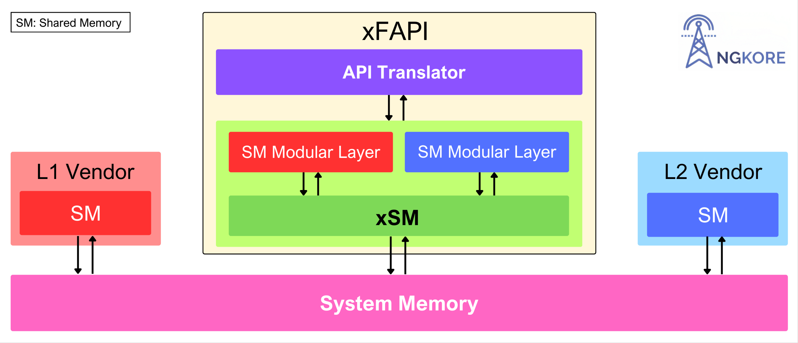

# Understanding xFAPI: Bridging L1 and L2 Layers of O-RAN

**Author:** [Shubham Kumar](https://www.linkedin.com/in/chmodshubham/)

**Published:** August 25, 2024

> _Part 2 of 3: xFAPI Series_

In our previous blog, we explored the gaps in the MAC-PHY layer of the O-RAN interface. In this blog, we will discuss how xFAPI addresses and resolves these issues.

## Challenges in L1-L2 Integration

Integrating the L1 and L2 layers of O-RAN from different vendors poses significant challenges due to incompatibilities in two key areas: vendor-specific APIs and inter-process communication (IPC) methods. For L1 and L2 components to communicate effectively, they must be compatible in both aspects.

### Vendor-Specific APIs

Vendor-specific API protocols are sets of rules that define the implementation of FAPI interface messages. Although standardized protocols like FAPI and nFAPI exist, many vendors either use proprietary protocols or introduce variations in their implementation of these standards. For instance, Intel’s FlexRAN utilizes a proprietary API mechanism, known as Intel APIs, for message exchange at the FAPI interface and incorporates modifications to the standard FAPI protocol.

### IPC Variations

IPC is the underlying layer that facilitates communication between components, using methods such as SCTP client sockets, Linux POSIX queues, shared memory, and more. Different vendors often adopt varying IPC mechanisms for establishing connections between L1 and L2. For example, Intel FlexRAN uses WLS, Nvidia Aerial employs nvIPC as their shared memory IPC mechanism, and OpenAirInterface (OAI) relies on nFAPI, which utilizes SCTP sockets.

## xFAPI: A Comprehensive Solution

To address these critical issues, xFAPI offers a comprehensive solution comprising two major components: the **API Translator** and the **IPC Integrator**.

- **API Translator:** xFAPI functions as an API Translator, translating vendor-specific APIs used by L1 and L2 vendors. This ensures seamless communication between components, regardless of the proprietary protocols employed by different vendors.

- **IPC Integrator:** xFAPI also acts as an IPC Integrator, supporting various IPC mechanisms at both the L1 and L2 interfaces. Currently, it includes shared memory (xSM) and socket-based communication (e.g. nFAPI), thereby providing interoperability between L1 and L2 components and overcoming IPC compatibility challenges.

## xSM: Unifying Shared Memory Implementations

The "x" in xSM signifies "any," while "SM" stands for "Shared Memory." xSM is an advanced shared memory library designed to standardize IPC through shared memory. It simplifies communication between L1 and L2 components, which often rely on different shared memory libraries. By unifying these diverse implementations into a single, unified package, xSM ensures a seamless and efficient shared memory IPC mechanism.

## Advanced Features of xFAPI

xFAPI includes an integrated feature that can be activated at runtime via a compilation flag. This feature checks interoperability between L1 and L2 and offers the option to use xFAPI if needed.

 

In addition to its core functions, xFAPI provides advanced features such as detailed PDU statistics generation at both interfaces, robust debugging tools like a memory logger, state manager, multi-level logging, and a comprehensive dashboard for monitoring and analysis.

**PDU Stats Generation:** xFAPI generates and stores detailed PDU statistics at both the L1 and L2 interfaces. This data is invaluable for monitoring, in-depth analysis, and debugging.

**Memory Logger:** This tool aids in debugging memory allocation issues by monitoring the addresses used and allocated for various purposes, making it easier to identify memory-related problems.

**State Manager:** The state manager tracks the L1’s state, such as Configured, Idle, and Running, and monitors the type and number of messages exchanged with each L1. This ensures that APIs are exchanged in the correct order and that no invalid APIs are sent based on the L1’s current state.

**Multi-Level Logging:** xFAPI supports in-depth debugging with multi-level logs, including INFO, DEBUG, ERROR, and more. It also allows logging across multiple horizontal levels, such as nFAPI, xSM, P5, and P7, enabling users to focus on logs from specific components. Additionally, xFAPI generates a log file at the end of each run, with configurable log levels.

**Dashboard:** The xFAPI Dashboard offers a comprehensive solution for monitoring and analyzing xFAPI’s performance. It supports remote log analysis with high flexibility, assists in status checks, and enhances the overall user experience.

In the following blog, we will examine how xFAPI fosters an interoperable environment for industrial L1-L2 solutions.
