# QUIC: The Future of Internet Transport

**Author:** [Shubham Kumar](https://www.linkedin.com/in/chmodshubham/)  

**Published:** June 26, 2025

QUIC (Quick UDP Internet Connections) is a modern transport protocol that fundamentally reimagines how data moves across the internet. Developed initially by Google and now standardized by the IETF, QUIC addresses the performance and security limitations of traditional TCP+TLS+HTTP/2 stacks by integrating transport, security, and application layer features into a unified protocol built on UDP.

## What is QUIC Protocol?

QUIC (Quick UDP Internet Connections) originated at Google in 2012 and has evolved into an IETF standard (RFC 9000). Unlike traditional web communication that relies on separate protocols for different functions (TCP for reliability, TLS for security, HTTP/2 for efficiency), QUIC integrates these capabilities into a single, cohesive protocol.

QUIC builds upon UDP as its foundation while implementing reliability, security, and multiplexing features typically handled by higher-layer protocols. The protocol operates primarily at the transport layer but incorporates functionality spanning OSI layers 4-6, providing an integrated solution for modern internet communication requirements.

## Why Use UDP as Foundation?

QUIC's choice of UDP as its underlying protocol addresses a fundamental challenge in internet protocol evolution: protocol ossification. This phenomenon occurs when network middleboxes (firewalls, load balancers, NATs) become deeply familiar with specific protocol behaviors and begin making assumptions about packet structures and flow patterns.

> **Protocol Ossification**: The gradual loss of flexibility in network protocols due to middlebox dependencies on specific protocol behaviors. When middleboxes expect certain patterns in protocol headers or packet flows, introducing protocol innovations becomes difficult as these devices may misinterpret or block new features.

TCP, after decades of deployment, suffers from significant ossification. Middlebox devices worldwide have implemented TCP-specific optimizations and assumptions, making it nearly impossible to deploy meaningful TCP improvements without compatibility issues.

UDP provides an ideal foundation for QUIC because:

- **Universal Compatibility**: UDP has existed since the early days of networking and enjoys universal support across all network infrastructure
- **Minimal Assumptions**: Network devices treat UDP as a simple datagram service, allowing QUIC to implement sophisticated features without middlebox interference  
- **Clean Slate**: UDP's simplicity provides a neutral foundation for implementing modern transport features without legacy constraints

## Traditional Protocol Stack: TCP+TLS+HTTP/2

The traditional internet protocol stack employed a layered approach with distinct protocols handling specific functions:

### Protocol Responsibilities

The conventional web communication stack utilized three primary protocols:

- **TCP**: Provided reliable, ordered data delivery with connection management and flow control
- **TLS**: Implemented cryptographic security, authentication, and data integrity protection  
- **HTTP/2**: Enabled efficient multiplexing of multiple requests over a single connection

This separation of concerns followed established networking principles, allowing each protocol layer to be developed, tested, and optimized independently. The modular approach facilitated protocol evolution and maintenance by enabling focused improvements to specific functionality areas.

For example, a browser connecting from Delhi to a server in California undergoes this process:

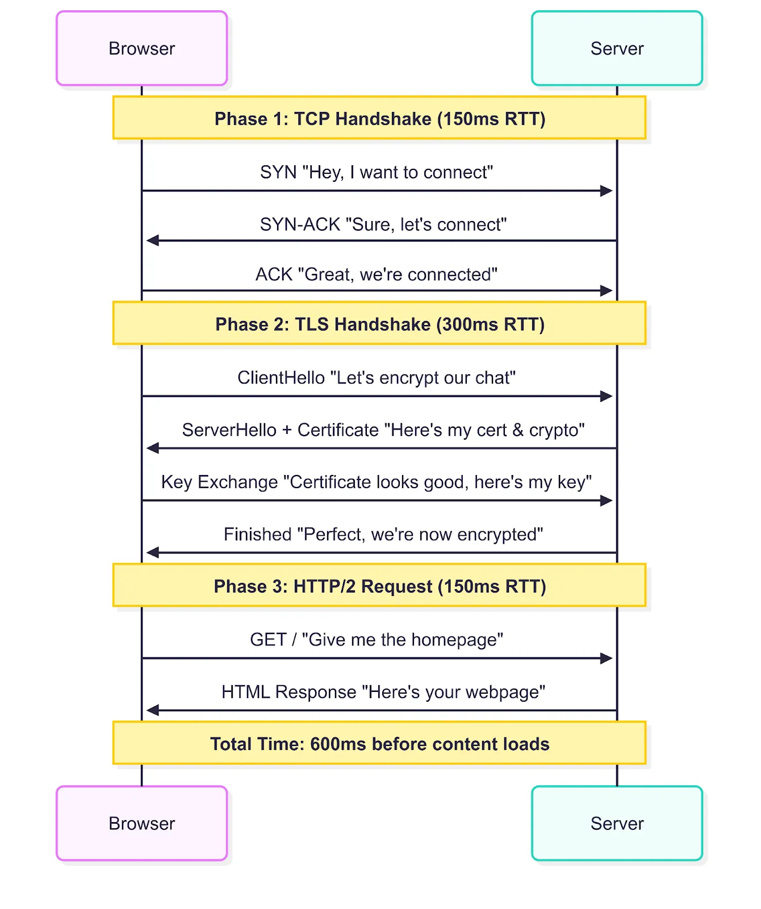

**Phase 1:** TCP Handshake (Round Trip 1)

- Browser → Server: “Hey, I want to connect” (SYN)
- Server → Browser: “Sure, let’s connect” (SYN-ACK)
- Browser → Server: “Great, we’re connected” (ACK)

**Phase 2:** TLS Handshake (Round Trips 2–3)

- Browser → Server: “Let’s encrypt our chat” (ClientHello)
- Server → Browser: “Here’s my certificate and crypto preferences” (ServerHello + Certificate)
- Browser → Server: “Certificate looks good, here’s my key material” (Key Exchange)
- Server → Browser: “Perfect, we’re now encrypted” (Finished)

**Phase 3:** HTTP/2 Request (Round Trip 4)

- Browser → Server: “Give me the homepage” (GET /)
- Server → Browser: “Here’s your webpage” (HTML content)

With a 150ms round trip time between geographically distant locations, connection establishment requires approximately 600ms before content delivery begins, representing significant latency overhead for modern web applications.

### Problems

The traditional approach suffered from several issues that made web browsing feel sluggish:

**Multiple Round Trips:** At least 3–4 round trips are required before any actual data can flow, resulting in high latency for every new connection.

**Head-of-Line Blocking:** Despite HTTP/2's multiplexing capabilities, TCP's ordered delivery requirement causes all streams to stall when any single packet is lost, as subsequent packets must wait for retransmission of the missing data.

**Connection Brittleness:** Transitioning between networks (such as WiFi to cellular) interrupts TCP connections, requiring users to restart their sessions and leading to performance degradation.

**Protocol Ossification:** Enhancements to TCP are difficult to deploy at scale due to incompatibility with middleboxes worldwide already optimized for the established protocol patterns.


## How QUIC Data Travels Now

QUIC integrates handshaking, security negotiation, and data exchange into one process, eliminating the multiple round-trip bottlenecks of the conventional stack.

QUIC’s design philosophy is simple: combine the best of all worlds while eliminating the worst. It provides TCP’s reliability, TLS’s security, and HTTP/2’s efficiency, but it does so without the overhead and complexity of running three separate protocols.

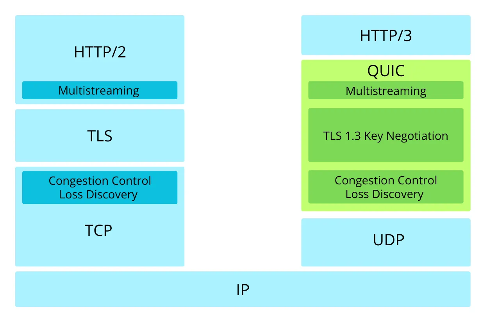

The main innovation lies in combining handshake states so that initial data requests can be made alongside the connection setup.

In a similar scenario of a client in Delhi connecting to a server in California:

**Phase 1:** QUIC Handshake (Round Trip 1)

- Browser → Server: “Connect + Encrypt + Give me homepage” (Initial packet with ClientHello + HTTP request)
- Server → Browser: “Connected + Encrypted + Here’s your webpage” (Server response with certificate + encrypted content)


As a result, content can be delivered within a single round trip (150ms in this example).

In cases where a client has previously interacted with the server:

**Phase 1:** 0-RTT Connection

- Browser → Server: “Here’s my cached crypto state + Give me homepage” (0-RTT packet)
- Server → Browser: “Here’s your webpage” (Immediate response)


With 0-RTT, the client can send its request instantly, receiving the response without any handshake-induced delay.

## Certificate Issuance (Pre-QUIC Handshake)

Before any QUIC handshake, servers need to obtain their certificates through a specific process:

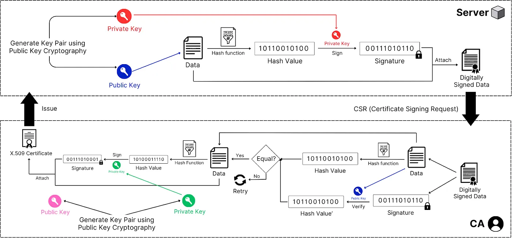

**Step 1:** Certificate Signing Request (CSR) Generation

- Server generates a public-private key pair
- Server creates data containing its public key, domain name, organization details, and other identifying information
- This data is passed through a hashing function and then signed with the server’s private key to create a CSR

**Step 2:** CA Verification and Signing

- Server submits the CSR to a Certificate Authority (CA)
- CA verifies the server’s identity through domain validation, organization validation, or extended validation
- CA creates certificate data including: server’s public key, domain name, validity period, CA information, and certificate policies
- CA hashes this certificate data using a cryptographic hash function (typically SHA-256)
- CA signs the hash with its private key, creating a digital signature
- CA combines the certificate data and signature to form an X.509 certificate

**Step 3:** Certificate Distribution

- CA issues the certificate to the server
- Server installs the certificate and can now present it during QUIC handshakes

## QUIC Handshake

The operation of QUIC when connecting to a website is as follows:

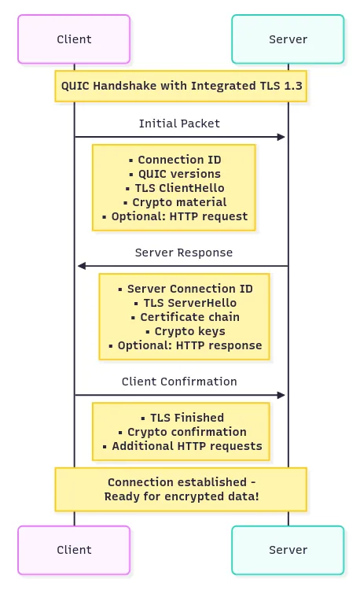

**Step 1:** Client Initial

- Client initiates connection and sends supported QUIC versions, cipher suites, and random number
- Client generates Connection ID (a random identifier that stays constant even if IP addresses change)
- Client embeds TLS 1.3 ClientHello directly within QUIC Initial packet
- Client includes QUIC transport parameters and initial cryptographic material
- Optionally includes early application data (HTTP request) for returning connections

**Step 2:** Server Response

- Server responds with chosen QUIC version, cipher suite, and its random number
- Server sends its certificate chain (server certificate + intermediate CA certificates) embedded in QUIC packet
- Server provides its own Connection ID and QUIC transport parameters
- Server includes TLS 1.3 ServerHello with cryptographic material to establish keys
- Server can optionally include early HTTP response data

> **Note:** The server sends the entire certificate chain because the client requires the actual cryptographic material for verification, not just issuer metadata.

**Step 3:** Certificate Verification and Completion

- Client extracts the certificate data and signature from the QUIC packet
- Client identifies the issuing CA from certificate information
- Client uses CA root certificates pre-installed in its trust store (without network contact)
- Client uses the CA’s public key from the trust store to verify the signature
- Client hashes the certificate data using the specified hash algorithm and compares it to the received value
- Client checks validity period, domain match, and certificate chain up to a trusted root
- Client derives QUIC connection keys from TLS key schedule
- Client sends TLS Finished message embedded in QUIC packet
- Connection is now ready for encrypted application data

**Step 4:** Secure Communication

All subsequent communication is encrypted using the established session keys. Unlike traditional TCP+TLS, TLS is integrated into QUIC, removing the separate handshake step and enabling application data to be exchanged as part of the handshake itself.

## The Head-of-Line Blocking Problem

Head-of-Line (HOL) blocking is a performance-limiting issue where a queue of packets is held up by the first lost packet, delaying all subsequent packets even if they could otherwise be delivered independently. This detracts from speed and responsiveness.

With HTTP/1.1, browsers opened multiple TCP connections, each capable of handling only one request. With HTTP/2, multiplexing was introduced so multiple “streams” could use a single TCP connection, resembling multiple simultaneous conversations. 

```console
Stream 1 (HTML): [chunk1] [chunk2] [chunk3]
Stream 2 (CSS): [chunk1] [chunk2]
Stream 3 (JS): [chunk1] [chunk2] [chunk3]

On the wire:
[HTML-chunk1][CSS-chunk1][JS-chunk1][HTML-chunk2][CSS-chunk2][JS-chunk2]…
```


This improved throughput, but TCP’s ordered delivery still caused all streams to wait for retransmission when any packet was lost.

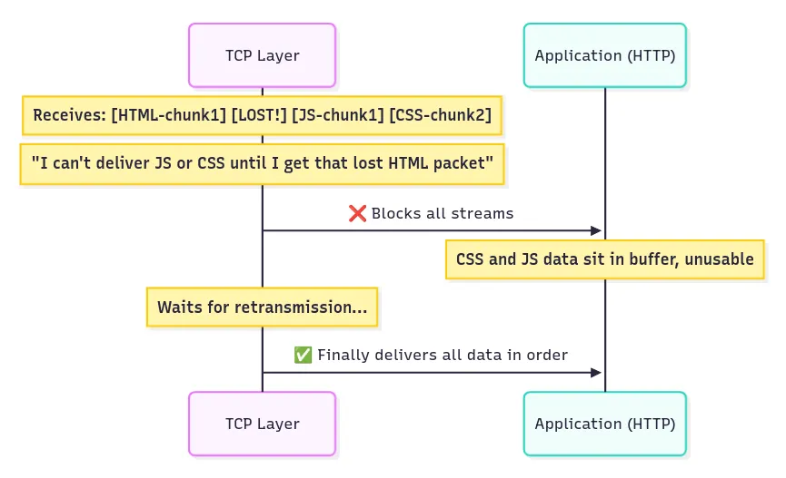

For example, if a packet carrying an HTML chunk is lost, TCP will hold all subsequent JavaScript and CSS chunks until the lost HTML chunk arrives.


Even if the CSS and JavaScript data arrive on time, they remain buffered in TCP until the lost HTML packet retransmits, increasing page load times.

### How QUIC Solves It

QUIC enables true stream independence at the transport layer. Each QUIC stream has its own sequence space, so a loss in one stream affects only that stream. Other streams continue without delay.

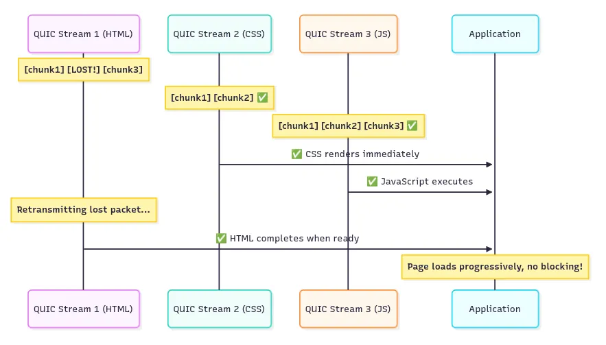

- QUIC Stream 1 (HTML): [chunk1] [LOST!] [chunk3] ← Only this stream waits
- QUIC Stream 2 (CSS): [chunk1] [chunk2] ← Continues normally
- QUIC Stream 3 (JS): [chunk1] [chunk2] [chunk3] ← Continues normally

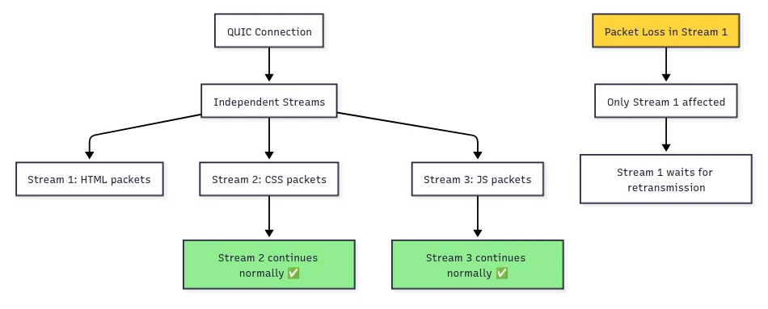

Each resource travels on its own delivery path. Loss in one does not halt delivery of others.

> **IMPORTANT:**
>
> HTTP/1.1 created multiple TCP connections for parallel downloads, which was inefficient. HTTP/2 allowed multiplexing multiple streams over a single TCP connection, which eliminated the need for multiple connections.
>
> HTTP/2, however, only solved head-of-line blocking at the application layer. Transport-level bottlenecks persisted because TCP blocks data delivery on a single packet loss for all streams.
>
> QUIC eliminates head-of-line blocking by managing stream reliability at the transport layer. Each stream is delivered independently, so a retransmission delay in one does not impact others.

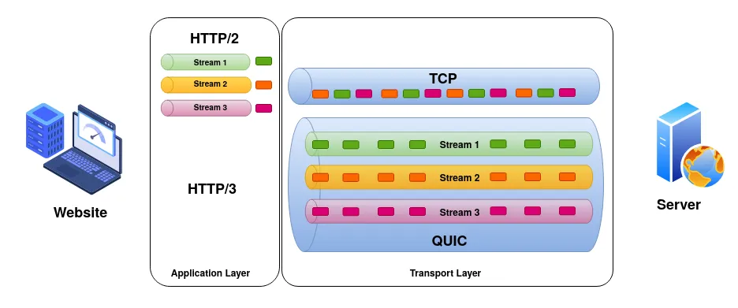

**Example:**

For a website with an HTML file (20KB), CSS file (50KB), JavaScript file (100KB), and 5 images (500KB each):

- **With HTTP/2 over TCP:** A lost JavaScript packet causes all other resources to wait, raising load time to 5–8 seconds.
- **With QUIC:** Only the JavaScript stream is paused. HTML, CSS, and images render while retransmission happens in the background, decreasing total load time to 2–3 seconds.

## Connection Migration

TCP connections are identified by IP/port combinations, so changing networks (such as moving from WiFi to cellular) disrupts communication, requiring a new connection.

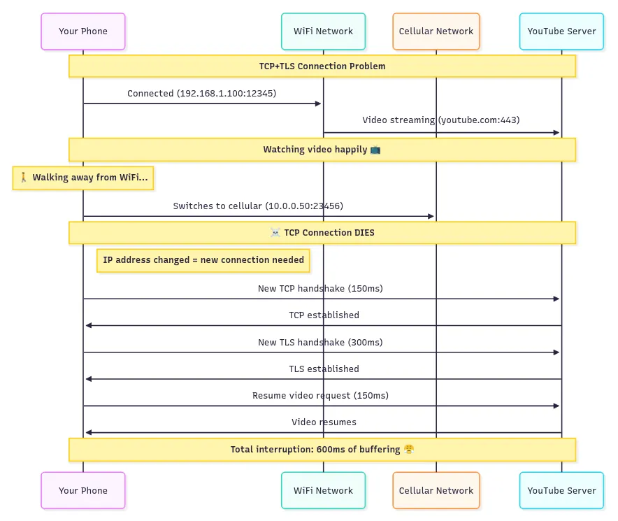

This is disruptive for real-time activities such as streaming video, which must buffer and reconnect.

QUIC uses Connection IDs, agreed on during handshake, as stable identifiers. As the client changes networks, the connection persists, enabling seamless migration for ongoing activities.

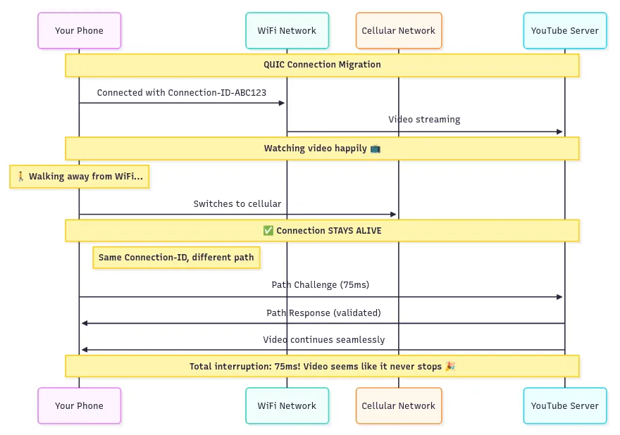

This supports uninterrupted experiences in mobile environments and can even enable transfers over multiple paths simultaneously as network conditions change.

## Security: Built-in vs Bolted-on

In traditional web stacks, TCP handles transport while TLS is added on top as a security layer.


This design introduces several issues:

- **Separate Handshakes:** Both TCP and TLS require their own handshake, increasing delay.
- **Partial Encryption:** TLS encrypts only application data, not TCP headers, risking metadata leakage.
- **Middlebox Interference:** Visible TCP headers allow interference and impede protocol evolution.
- **Attack Surface:** Multiple handshake stages expose more points for potential attacks.

QUIC is fundamentally different: security is native, not added.

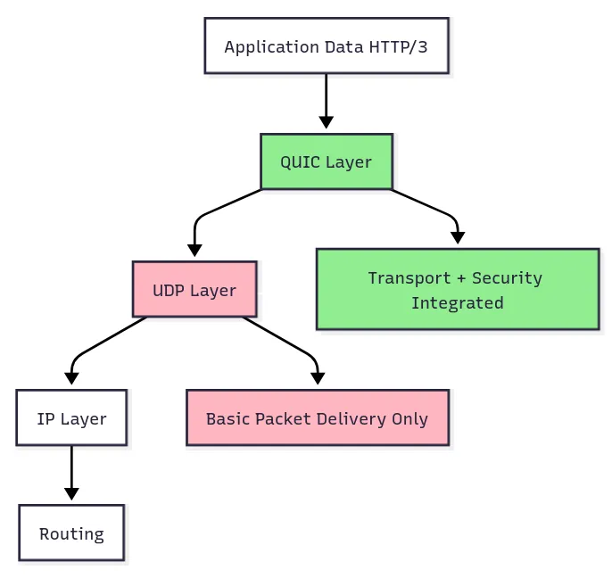

Advantages include:

- **Single Handshake:** Security setup and connection establishment are unified.
- **Comprehensive Encryption:** Nearly all protocol fields, including packet numbers and connection state, are encrypted.
- **Ossification Resistance:** Encrypting protocol internals reduces middlebox assumptions, enhancing adaptability.
- **Stronger Security Model:** The integrated approach limits possibilities for downgrade and establishment attacks.

## Conclusion

QUIC represents a fundamental advancement in internet transport protocols rather than an incremental improvement. The protocol addresses the core challenges of modern internet communication: global latency requirements, mobile connectivity patterns, and the imperative for integrated security and performance.

While the TCP+TLS+HTTP/2 stack served the internet well during its evolution, QUIC provides a purpose-built solution for contemporary networking demands. The protocol is actively deployed in production environments, with major services including Google, YouTube, Facebook, and numerous CDN providers implementing QUIC support.

This widespread adoption demonstrates QUIC's transition from experimental technology to foundational internet infrastructure, delivering measurable improvements in connection establishment time, data transfer efficiency, and network resilience.
